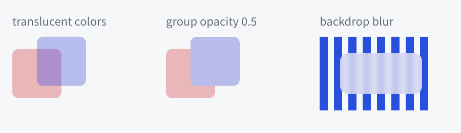

# 默认组件、主题与动画

状态：v0.1。当前已有基础行为、中性皮肤、局部样式、可替换纯函数皮肤、小型 Theme 及其子树继承；外观与位移过渡、完成回调和原生 App 的系统深浅色/高对比/减少动态效果跟随已接入；缩放/旋转动画、作用域过渡（`with_transition`/`snap`）、关键帧与弹簧动画、逐 token 的 `ThemeOverride`、系统文本缩放、惯性滚动、渐变/阴影（阴影可补间）与组透明度/背景模糊已实现；第三方控件可经 `Control` trait 定义任意行为与绘制（`aegle-widgets/examples/custom_control.rs`）。三者共用属性、状态、生命周期和失效规则，不建立第二套运行时。对应 R12、R17–R21。

## 当前行为接口

`aegle-controls::Button` 保存 enabled/focused/hovered/pressed，不含标签或绘制。指针按下请求 capture，匹配释放且仍在命中区才激活；Space 在释放时激活，Enter 只在首次按下时激活，重复按键不重复触发。失焦、取消和禁用释放 capture，不产生激活；语义 `Input::Activate` 同样检查启用状态。

可选 `text` 的 `TextField` 直接拥有 Editor，复用选择、按词/行移动、grapheme 删除、撤销、单行提交和原子 IME 事务。宿主提供当前文字局部坐标，应用 `Outcome` 的焦点/capture/重绘/IME 重置请求，并消费 Editor 的失效标记。`Outcome::semantics` 独立表达焦点/启用状态变化，普通 hover/pressed 绘制不会因此重新导出语义。只读仍可选择；失焦或禁用取消组合且恢复已提交值。复制/剪切/粘贴经 `Outcome::clipboard` 交给宿主，`Input::Paste` 回送文字；密码模式遮盖显示、拒绝复制与组合。更多平台差异快捷键尚未接入。

这些行为可由不同皮肤共享；当前 `aegle-widgets` 已将它们与 row/column、标签及单行/多行编辑器组合，使用统一 Theme 绘制中性基础外观，并同步布局、命中、IME 和可选 Unix 系统语义。皮肤（`set_skin`、`set_kind_skin`）可替换现有控件的配色、边框、圆角和文字装饰，不重写行为；新行为与绘制通过实现 `aegle_ui::Control` 加入，见[不经 facade 使用控件库](developer/standalone.md#自定义控件)。控件行为层不创建窗口或定时器。

## 当前切换与数值控件

`Container::check_box(text, checked)` / `switch(text, checked)` 创建带可选可见标签的二态控件；标签同时作为默认无障碍名称，`set_accessible_label` 可覆盖。Toggle 复用 Button 的按压、捕获、Space 释放/Enter 首次按下与语义激活规则；复选标记和开关位置都表达当前状态，不只用颜色区分。CheckBox 另有部分选中（`set_mixed`）；`radio(text, checked)` 的单选按钮按同一父容器分组，选中一个即取消其余。触摸经 `Ui::touch` 转为同样的指针行为，没有专属触摸处理。

`slider(min, max, value)` / `progress(min, max, value)` 共用独立 `aegle-controls::Range`；边界与数值为 f64，要求有限、min < max 且跨度有限，有限越界值按公开契约 clamp。`set_range` 原子替换边界，失败保留旧状态。Progress 不接受焦点或用户调整；`set_indeterminate(true)` 显示 1.6 秒往复扫过的不确定进度，期间经 `PaintCx::request_frame` 逐帧重绘，关闭后停止请求帧。两者都有 `set_orientation(Orientation::Vertical)`：竖直时自下而上增长，指针位置按竖轴换算。

Slider 为水平连续滑块；`set_step(step)` 可选有限非负步长，零表示连续。步长以 min 为网格起点，max 为额外可达端点；取最近值，等距时取较大值。步长低于浮点可表示精度时不声称精确网格。单步在额外最大端点向下移动至最后格点，例如0..10/step3为10→9→6。方向键/语义调整使用一个步长，连续时为跨度的1%；PageUp/Down为十步或10%，Home/End到端点。数值增量低于一个浮点间隔时按下一可表示数推进。

指针按下轨道直接设值并捕获；拖出仍 clamp 到端点，其他指针不能接管。失焦、禁用、取消或删除释放捕获并保留最后值；取消不会回滚整个拖动。输入和绘制共用轨道起点/长度计算，零长度轨道不做指针调值；键盘及语义路径仍可用。

`on_change(|control| ...)` 与按钮回调共用版本化队列，在树借用外执行。用户/语义操作真正改变值才排队；`set_checked` / `set_value` / `set_range` / `set_step` 是模型更新，不回调，方便多个控件同步且不会形成循环。处理器读取执行时的最新值，通知不保存每次中间值；替换处理器或销毁节点会丢弃旧通知。显式 `toggle`、`increment`、`decrement` 走用户行为并检查有效可见/启用状态。

默认标志为18dp复选框或36×20dp开关；滑块手柄16dp，轨道2dp、完成部分4dp，以粗细差异辅助表达数值。小尺寸时缩小标志并裁剪至自身范围，布局宽度优先容纳可见标签；当前不做标签自动换行。字号/主题切换复用同一段落，值变化不重排文字。外观可用 Skin/Style 和 `indicator_color` 修改；checked 与开关位置即时更新，配色/焦点轮廓沿用现有外观过渡。启用 `motion` 时，Slider/Progress 的程序化数值变化以 120 ms ease-out 滑向新值（用户拖动直接跟手），减少动态效果偏好下立即到位；开关位仍无位移动画。聚焦的 Slider 消费滚轮，每 16 逻辑像素移动一步，未聚焦时滚轮照常滚动外层视图。

`widgets` 示例用 `.aegle` 构造四种控件和 CJK 编辑器，通过简短 Rust 回调实现互相同步、启禁编辑、进度更新、主题切换与窗口关闭。

## 当前分隔、数值输入、标签页、分割与提示

- `separator()`：1 逻辑像素的主题边框色分隔线，在 Row 中为竖线、在其他容器中为横线，沿交叉轴拉伸；不可聚焦，语义为带方向的 separator。
- `number_field(min, max, value)`：复用单行编辑器的数值输入，右侧 20dp 宽的上下步进区；`set_step`、`set_decimals(0..=9)`、`set_range`、`set_value`，上/下键与 PageUp/PageDown 按步长或十步调整，聚焦时滚轮调整。Enter 或失焦时解析文本，越界 clamp，不能解析时恢复上次值；值真正改变才调用 `on_change`。语义为 SpinButton 并报告数值与范围。
- `tabs()` 与 `Tabs::add(title)`：每页为一列，只显示选中页；标签为按钮变体（`Variant::Tab`），选中项画下划线，可单击、Enter/Space 激活，聚焦标签时 Left/Right 循环移动并选中。`select` 不回调，用户切换才调用 `on_change`。语义为 TabList/Tab（selected）/TabPanel。
- `splitter(Orientation)`：两个窗格加 6dp 可拖动把手；`first()`/`second()` 返回窗格，`set_ratio(0..=1)` 设置首窗格占比。把手可聚焦，方向键每次 2%，Home/End 到端点；拖动时按把手中心换算比例。
- `NodeWidgets::set_tooltip(Some(text))`：任意控件可设提示；指针在该控件（或没有自己提示的子孙）上停留 `TOOLTIP_DELAY`（500 ms）后，在指针右下方以反色标签显示，空间不足时翻到上方并保持在窗口内。按下、Escape、移开或删除控件时隐藏；文字同时作为无障碍描述。延时由 `State::wake` 驱动，原生循环按最近的唤醒时间限定等待，不轮询。

这些组件都通过公开的 `Hooks`（press/place/removed/key 以及新增的 hover、wake）与 `PaintCx::request_frame` 实现，没有私有引擎入口；第三方控件可用同样方式获得悬停、延时与逐帧绘制。

## 当前局部样式与组件复用

`aegle-theme` 提供无分配的 `ControlKind`、`VisualState`、`Appearance`、`Style` 和 `Skin`，可独立于 app 使用。`ControlKind` 是控件库声明的 `static`：名称、默认皮肤、可接受的样式组与是否为布局容器，按地址比较；内置控件的类型与中性皮肤在 `aegle_widgets::kinds`，第三方类型与它们同一形式。VisualState 包含控件类型、有效 enabled、hovered、pressed、focused 和编辑器 read_only；focused 表示焦点可见（focus-visible）：控件有焦点，且最近一次输入是按键，或控件是编辑器。指针按下使焦点不显示焦点环与焦点层，任一按键恢复显示；`Node::is_focused` 查询逻辑焦点本身。祖先禁用反映在有效 enabled 中。当前 app 的按钮/编辑器提供 hover 和 focus，pressed 由按钮、切换控件和滑块行为提供；其他种类的相应状态为 false。

皮肤是纯函数 `fn(&Theme, VisualState) -> Appearance`，有三个作用范围：类型的默认皮肤、`Node::set_kind_skin(kind, Some(skin))` 给该子树（含自身）中这一类型的全部控件（最近的子树规则生效，之后新建或移入的控件同样跟随）、`Node::set_skin(Some(skin))` 只给该控件；`None` 移除对应规则。每个节点缓存解析出的皮肤指针，设置、reparent 与插入时只重新解析受影响的子树，绘制时不查找祖先；控件的交互状态改变时（类型可能随之改变，如切换按钮选中后换成另一类型）在存在皮肤规则时重新解析该节点。皮肤只能根据传入数据计算，不能重入 UI 或执行应用回调；不捕获环境、不创建注册表或虚函数对象。当前结果在安装前验证，以后状态在刷新时验证；非有限或负几何返回错误，不静默回退。皮肤不决定布局或字号。

`Node::set_style(Style)` 设置稀疏本地覆盖；`set_background`、`set_foreground`、`set_radius` 等是它的单字段简写，传 `None` 让该字段回到皮肤值。`style()` 读取覆盖，`appearance()` 读取当前解析结果。`set_style(Style::default())` 清除全部覆盖，`set_skin(None)` 单独移除节点皮肤。完整优先级表见[API 指南](developer/api.md#6-外观主题样式与皮肤)。局部字号通过 `set_font_size(size)` 设置、`set_font_size(None)` 回到主题字号，仅适用于文字控件，不向子节点继承。

解析顺序为默认/自定义皮肤 → 本地基础覆盖 → 本地 disabled、pressed 或 hover 覆盖。高优先状态没有指定覆盖时保留基础值，不回落到其他状态；focus 环最后独立绘制；有效启用且聚焦时才有非零目标宽度，失焦过渡可短暂保留渐隐的呈现轮廓。边框与 focus 宽度为零可关闭，相对于自身矩形向内绘制，不侵入相邻控件；容器圆角不隐含对子树的裁剪。hover/focus 覆盖限交互控件，pressed 覆盖限按钮/切换控件/滑块，selection/caret 限编辑器，indicator 限复选框/开关/滑块/进度条；对应 setter 只定义在这些控件的类型化句柄上（`handle!` 的样式组），误用在编译期报错，标记属性也在编译期拒绝；只有整体传入的 `Style` 值在运行时检查并返回 WrongKind。

局部视觉数据按 NodeId 放在 Ui 的稀疏表中，无样式节点不保存一份完整 Style。纯配色/边框变化只失效绘制，前景色同时失效语义；自定义皮肤可随交互状态改变前景，相关状态变化会同时刷新语义。字号改变才重排文字及布局，保持编辑器、组合输入、选择和控件身份。

普通 Rust 函数组合现有控件即可形成组件库。`crates/aegle/examples/components.rs` 使用按钮工厂、主题皮肤和 `.aegle` 结构展示复用，并用局部深色主题和滑出后关闭演示继承与完成回调；它不是完整 MD3 套件。`Canvas` 提供绘制扩展，`set_input` 后接收指针、滚轮、按键与焦点事件作为自定义输入行为；`ListView` 提供等高虚拟列表，`ImageView` 显示共享图像。

## 默认组件范围

默认皮肤采用跨平台一致的中性极简外观。首版包含 Box/Row/Column、Text、Button、CheckBox（含部分选中）、RadioButton、Switch、Slider 与 Progress（含竖直与不确定进度）、NumberField、Separator、Tabs、Splitter、Tooltip、TextField、TextArea、ScrollView、等高与按内容变高的虚拟 ListView、基础 Table、Dropdown，以及窗口内 Popup、建立在 Popup 上的 Menu（右键菜单、子菜单、勾选项）与 MenuBar。Grid、图像格式、路径图标和高级特效按 feature 提供。

默认 Popup/Menu/Tooltip 在当前窗口的 overlay 层内显示，不承诺越过宿主窗口边缘；需要独立原生 popup 的 shell/应用通过平台扩展显式创建，走相同焦点及语义契约。当前 Popup、Dropdown 列表与菜单即在此层：显示于锚点下方（空间不足时上方）、子菜单在打开项旁、上下文菜单在请求点，放不下时翻转并夹在窗口内；Escape 或按下外部关闭并归还焦点，关闭时连带其内部锚定的弹出层。首版的表格只有固定行高、表头与虚拟行，没有排序或列宽拖动；没有富文档编辑器或完整 MD3 套件，第三方可用公开接口实现。

行为与皮肤分离：controls 负责激活、切换、调整、编辑、滚动等行为及语义，widgets 负责默认外观。第三方 MD3 库应复用 controls，并增加自己的 token、图标与绘制；不重写平台输入、CJK 或无障碍。

## 视觉规范

| `Theme` 字段 | 浅色 | 深色 |
| --- | --- | --- |
| background | #F6F7F9 | #15181D |
| surface | #FFFFFF | #1E232B |
| foreground | #20242B | #F0F2F5 |
| muted | #5B6472 | #ADB6C4 |
| accent（焦点与标记） | #355CDA | #9EB5FF |
| border | #737D8C | #788596 |
| hover | #ECEFF5 | #2A313C |
| pressed | #DEE5F0 | #2F3744 |
| selection | #D5DFFF | #2D4076 |

尺寸采用 dp；主题只有一个正文字号 14 dp，padding 与 gap 8 dp，控件高 36 dp，字体族使用带 locale 的系统 sans-serif 回退。没有紧凑或触摸尺寸模式；其他排版角色由组件库经 `Control::text_role` 定义。默认控件、面板、标志、开关、滑块和进度条均为直角（主题圆角 0）；应用设置正的主题 radius 时这些默认控件统一圆化。边框 1 dp，焦点环 2 dp。

默认不使用背景模糊、大面积阴影或持续装饰动画。hover/pressed 用轻度叠色，拖动响应直接；disabled 不只靠变淡区分，语义同步不可用状态。选中、错误和焦点不能仅靠颜色，应有形状/标记或文字反馈。

普通文字对比度目标至少 4.5:1，交互轮廓/焦点目标至少 3:1。此处是内置主题的设计要求，不是认证声明；框架不检查应用自定义颜色的对比度。高对比模式把默认 token 调整为系统或黑白高对比配色；内置 `high_contrast()` 为黑底白字与白色轮廓、黄色焦点和标记，禁用与次要文字使用对黑底 8:1 的灰色，使禁用控件与启用控件可区分。显式本地覆盖仍由应用负责。

## 主题契约

当前可用的 `aegle-theme::Theme` 是公开字段的无分配快照：颜色为 `background/surface/foreground/muted/accent/border/hover/pressed/selection`，尺寸为 `font_size/padding/gap/radius/control_height`。`light()`、`dark()`、`high_contrast()` 提供显式配色；`Default` 为浅色。三种配色共用正文 14、padding 8、gap 8、圆角 0、控件高 36 的逻辑像素尺寸；窗口可用 `set_padding` 独立增加外侧留白。`validate()` 拒绝非有限或负尺寸，并要求正文大小和控件高度大于零。accent 用于焦点/标记，selection 与普通 foreground 配对，不隐含另一套文本颜色。

`Ui::set_theme`（没有局部主题的节点的基础主题）与 `Node::set_theme`（含 `window.set_theme`，即根节点的局部主题）都更新现有控件，不重新创建编辑器。颜色切换更新外观；字体或尺寸变化使相应布局失效。焦点、文本、选择及预编辑保留。本地布局、字号和视觉覆盖优先于主题，自定义皮肤按新 Theme 解析。

`Node::set_theme(Some(theme))` 给该节点及其子树一份完整主题快照，`None` 恢复父级解析结果；嵌套局部主题优先于祖先，`Ui::set_theme` 只更新没有局部主题的节点。每个节点缓存共享快照的 `Rc`，绘制、布局、命中、滚动条、IME 和语义按同一解析结果读取，不在热路径上逐级查找祖先。新建和 reparent 的控件继承新父级的主题，变化只重排受影响节点。窗口清屏色取根节点的解析主题。`Node::set_theme_override(Some(ThemeOverride))` 则只替换指定字段，其余沿父级解析主题；它随父级或 `Ui::set_theme` 的变化重新解析，嵌套覆盖逐层叠加，`set_theme` 的快照会替换它。

主题使用类型化 token：类型为 Color、Length（有限非负逻辑像素，圆角也用它）、Duration、Font（`Font { families, weight, italic }`，不含字号；families 不能为空，weight 为 1–1000）与 Shadow（`aegle-types` 的 `Shadow`，几何有限、模糊非负）。`aegle-theme` 定义 `Token<T>`（只含 u16 索引）、`TokenKind`/`TokenValue` 与 `TokenType`（Color、f32、Duration、Font、Shadow），14 个 Theme 字段即内置 token `Theme::ACCENT` 等，名为 `theme.<字段>`，占索引 0–13。`aegle-ui::register_token(name, default)` 在每线程一份、所有 Ui 共享的注册表中登记 `包.名称` 形式的组件 token（点分 ASCII 字母、数字、`_`、`-`，`theme.` 保留），默认值是纯函数 `fn(&Theme) -> T`，随主题变化；同名同类型再次登记返回原句柄，类型不同返回 `UiError::Token`。`token::<T>(name)` 按名查找。名称只在登记/查找时解析为索引，节点和绑定只存索引。

全局主题是共享不可变快照，局部主题只保存稀疏覆盖。查找顺序为最近局部覆盖到全局默认；作用范围沿逻辑控件树继承。`Ui::set_token` 设全局覆盖，`Node::set_token` 设子树覆盖，`None` 移除；自定义 token 依次取最近祖先的覆盖、Ui 覆盖、按节点解析主题求默认值，局部主题快照不遮蔽自定义 token。内置 token 的覆盖就是主题本身：`Ui::set_token` 替换 Ui 主题的该字段（不能为 None），`Node::set_token` 写入该节点的 `ThemeOverride`。绑定让属性跟随 token：`Node::bind_color(ColorSlot, Token<Color>)` 绑定 Style 的 11 个颜色或背景渐变的色标（`ColorSlot::GradientStop(i)`）；`bind_length(LengthSlot, Token<f32>)` 绑定边框宽度、圆角、焦点宽度、文字控件字号、统一 padding 或 gap；`bind_font(Token)` 绑定文字控件的字体（等同 `set_font`）；`bind_shadow(Token<Shadow>)` 绑定阴影（等同 `set_shadow`）；启用 `motion` 时 `bind_transition(TransitionProperty, Token<Duration>, Easing)` 绑定该项过渡的时长，曲线在绑定时给定。绑定时立即写入，`Ui::set_theme`、局部主题/覆盖、reparent 与 token 改变后重新解析同一子树内的绑定。任一绑定拒绝新值（例如字号为零）时，`set_token`、`Ui::set_theme`、`Node::set_theme`/`set_theme_override` 与 `reparent` 都恢复改变前的状态（含原父节点与位置）并返回错误。绑定和子树覆盖随节点删除。

组件状态样式采用固定状态集合及明确优先顺序：disabled、pressed、selected/checked、hover、normal；focus 环作为独立覆盖，不被 hover 隐藏。复合组件需要不同优先级时在自己的有类型样式函数中显式定义，不引入 CSS specificity。

控件默认值 → 主题/状态值 → 本地常量或绑定，构成逻辑目标；优先级总表见[API 指南](developer/api.md#6-外观主题样式与皮肤)。动画覆盖呈现值。一个属性的本地值要么是常量要么跟随 token，后写者生效：`set_background` 等单项 setter 写该字段并结束该项绑定，`set_style` 写全部字段因而结束全部 Style 绑定，`cancel_transition` 同样写入全部 Style，`set_font_size`、`set_font`、`set_padding`、`set_gap` 结束各自的绑定，`set_transition`（含传 `None`）结束全部时长绑定，`set_property_transition` 结束该项的时长绑定；`unbind_token` 结束绑定并清除该属性（字体回到 `Font::DEFAULT`，padding/gap 回到控件的主题默认值，过渡变为立即）。颜色变化只刷新绘制，字体/尺寸变化才使布局失效，语义无关的 token 变化不广播语义值更新。

默认跟随系统深浅色、对比度、文本缩放与减少动态效果；应用可显式选 Light/Dark/System。系统没有提供某项偏好时用默认值并允许应用配置。系统字体缩放与设备像素缩放各应用一次，不能重复放大。

当前原生 App 从平台读取 `Preferences { dark, high_contrast, reduced_motion }`（各为 `Option<bool>`，None 表示系统未报告）。Linux 经会话总线读取 XDG desktop portal 的 `org.freedesktop.appearance`（color-scheme、contrast、reduced-motion）并监听 SettingChanged；Windows 读取 `AppsUseLightTheme`、`SPI_GETHIGHCONTRAST` 与 `SPI_GETCLIENTAREAANIMATION`，在 `WM_SETTINGCHANGE` 时重读。窗口主题按 high_contrast_theme → dark_theme → theme 解析，对应偏好为 true 且选项不为 None 时才采用；显式选择浅色或深色即把其他两项设为 None 或相同主题。`reduced_motion: None` 跟随系统，未报告时为 false。偏好变化只更新仍等于变化前解析值的窗口主题/减少动态效果，应用显式设置的值保留：`window.set_theme(..)` 给根节点局部主题，系统偏好只改变 Ui 的基础主题；`window.ui().set_reduced_motion(..)` 同理。`Preferences::text_scale`（百分比，50–400）来自 Windows 的 `TextScaleFactor` 与 portal 的 GNOME `text-scaling-factor`；`AppOptions::text_scale` 显式覆盖，原生 App 把解析后主题的 `font_size` 与 `control_height` 按它缩放，且与设备像素缩放各应用一次。系统未报告时保持 100%。无窗口 Ui 不读取系统偏好。

## 当前外观过渡

可选 `motion` 已提供 `Node::set_transition(Transition::new(Duration::from_millis(120), Easing::EaseOut))`，同时过渡背景、文字、边框、圆角、焦点环、选择和 caret 的外观值。`appearance()` 返回逻辑目标，`presented_appearance()` 返回最近采样值；失焦/禁用的焦点宽度目标为零，绘制使用相同呈现值。前景动画同步语义颜色，不重新成形文字，也不延迟焦点、文本、预编辑或命中状态。同一策略也过渡位移、缩放与旋转；布局、字号和窗口清屏背景当前不做过渡。

`set_property_transition(TransitionProperty, Option<Transition>)` 单独设置外观（Paint）、位移（Offset）、缩放（Scale）、旋转（Rotation）、组透明度（Opacity）或阴影（Shadow）的时长与曲线，`property_transition` 读取；`set_transition` 等同于六项相同。某项为 None 时该属性直接到目标，运行中的该项补间立即跳到目标且不单独完成；六项都为 None 时移除策略。各项独立补间，缩放与旋转共用一个 Transform 目标，但呈现值分别取样。原生 App 的默认策略在首次绘制前不补间几何。

`Node::set_offset(Point)` 在布局后平移节点及其子树，不改变布局或滚动范围；`bounds`、命中、裁剪、IME 候选锚点和无障碍边界都使用呈现位移。没有 motion 或过渡策略时立即生效；有策略时从当前呈现位移开始补间，请求在下一次刷新时以宿主当前时钟开始，因而回调中设置也不会因旧时间戳直接结束。位移采样只更新几何，不重新录制绘制记录。`offset()` 返回逻辑目标。运行中的位移保留开始时的时长。

`set_transition(None)` 移除策略并立即回到目标；`finish_transition()` 立即到达当前目标；`cancel_transition()` 将最近呈现写为本地外观覆盖和位移目标，替换状态颜色覆盖，保留后续设置的过渡策略。焦点轮廓的可见性仍受真实行为约束。

`on_transition_end(callback)` 在节点所有活动过渡（外观、位移、缩放、旋转、透明度和阴影中最晚的一项）到达目标后排队一次，与点击回调共用版本化队列，在借用外执行。正常结束、`finish_transition()`，以及有策略时因减少动态效果、隐藏或零时长而直接跳到目标的变化都会完成；取消、`set_transition(None)`、删除节点或关闭窗口不完成，已排队的通知随节点删除丢弃。

## 显式动画入口

过渡策略是“属性变化时怎样到达新值”的长期设置；需要只针对某一次变化时使用作用域入口，不改动策略：

- `node.with_transition(timing, || ...)`：闭包内对该控件的外观、位移、缩放与旋转修改按 `timing` 补间，无论它有无策略；没有策略的控件从当前显示值开始。闭包结束后的修改恢复按策略处理，已开始的补间跑完。对其他控件的修改仍按各自策略。
- `node.snap(|| ...)`：闭包内对该控件的修改立即生效，不补间；同一属性正在进行的过渡跳到新值并完成。Slider/Progress 的程序化数值滑动也遵守它（经 `State::snapping` 供控件库查询）。
- `node.animate(Animate::Offset(..) | Scale(..) | Rotation(..) | Opacity(..))`：启动一个 `aegle_motion::Animation`，从其第一个关键帧开始，替换该属性正在进行的过渡或动画；结束时停在 `Animation::target`，它也是 `offset()`/`transform()` 读到的逻辑值。它与过渡共用 `is_animating`、`finish_transition`、`cancel_transition` 和 `on_transition_end`。

`Animation` 由关键帧（`Keyframe::new(at, value).easing(..)`，`at` 从 0.0 到 1.0 不倒退，同位置的后一帧表示跳变）、一个周期时长、`delay`、`cycles(Cycles::Times(n) | Cycles::Forever)` 与 `alternate` 组成；`Animation::tween(from, to, timing)` 是不分配内存的两帧特例，自动过渡内部也用它。序列即多个关键帧；不同属性或控件之间的先后由 `on_transition_end` 串联。`Cycles::Forever` 不会自行完成，运行期间宿主持续出帧，需要 `finish_transition`/`cancel_transition` 停止。外观（颜色）没有显式关键帧入口，由过渡与作用域入口覆盖。

曲线：`Easing` 除四种二次曲线外有 `Easing::cubic_bezier(x1, y1, x2, y2)`（同 CSS，x 须在 0..=1，y 可越界）与 `Easing::Spring(Spring::new(stiffness, damping)?)`（单位质量阻尼弹簧，阻尼低于 2√stiffness 时回弹）。`Transition::spring(spring)` 以弹簧稳定到 0.1% 以内的时间作为时长。越界曲线让进度暂时超出 0..=1：位移、旋转随之越过目标，颜色在端点截断，边框/焦点宽度与圆角不小于 0，缩放保持为正。

无窗口 Ui 默认不安装过渡。`set_default_transition` 只影响随后创建的交互控件；首次刷新直接建立呈现值，不做入场动画。原生 App 在启用 motion 时为交互控件默认安装120ms EaseOut，`AppOptions.transition=None` 可关闭自动安装。各 App 共用一个单调时钟，通过 Wayland frame callback 推进；没有活动动画时不请求动画帧，无轮询定时器。隐藏子树刷新时直接到目标；compositor 暂停窗口帧回调时不主动唤醒，恢复时采样当前时刻。

`Ui::advance_animations(Duration)` 供独立宿主显式采样，拒绝时钟倒退；随后按常规 refresh/呈现。新目标从最近采样的呈现值开始。`is_animating()`/`has_animations()` 反映外观、几何过渡或显式动画是否仍活动，节点删除和窗口关闭立即清理对应动画及完成处理器。`Ui::set_reduced_motion(true)`（原生窗口经 `window.ui()`）立即到目标并完成，保留最后一帧重绘；期间不启动新过渡，`with_transition` 与 `animate` 也直接到目标。原生 App 默认跟随系统减少动态效果偏好，`AppOptions.reduced_motion` 可显式覆盖。

## 动画约束

颜色在预乘线性空间插值；没有通用时间线编辑器或动画脚本。默认过渡只有一个：原生 App 给交互控件安装的 120 ms ease-out，开关位置与面板出现没有单独的时长。几何动画只改呈现变换，命中与候选窗跟随；没有 width/height 动画，布局尺寸变化立即生效。同一 UI 共用时钟，只管理活动动画；没有活动动画就没有动画定时唤醒，默认皮肤不启动永久循环。减少动态效果开启时所有过渡与动画直接到目标（见上节），进度仍通过语义值表达。

## 组件作者的完整接口

| 任务 | 提供的能力 |
| --- | --- |
| 组合 | 创建子控件、输入属性、事件、内容 slot、生命周期清理 |
| 布局 | Taffy 属性、内容测量、基线、滚动和裁剪 |
| 交互 | 指针捕获、键盘、焦点、状态、语义动作及默认行为复用 |
| 绘制 | 文字、图像、矩形、圆角、边框、变换；可选路径/特效；装饰器（`Decorator`）在任意控件的背景之下、内容之上追加图元并观察其输入 |
| 文本编辑 | PlainEditor 接入、选择、剪贴板、IME、密码/只读与撤销 |
| 无障碍 | 角色、标签、值、关系、文本范围、动作和合并规则 |
| 风格 | 自定义 token、局部主题、状态颜色和系统偏好 |
| 动效 | 过渡、显式动画、取消/完成与可选弹簧 |

组件库接口见 [Rust API](rust-api.md#组件库作者)，可执行的自定义控件见 `aegle-widgets/examples/custom_control.rs`。一次 MD3 风格 Button/TextField/Switch 示例必须共同覆盖主题、动效、键盘、CJK、IME 和语义，不能只验证静态外观。

## 呈现变换、惯性与图像特效

- `Node::set_transform(Transform { scale, rotation })`：scale 为有限正数，rotation 为弧度，以节点边界中心为原点，子树继承。它只是呈现层变换：布局、滚动范围和 `bounds` 不变；`visit_scenes` 给出的矩阵包含它，命中与指针局部坐标做逆映射，滚动视口的裁剪取变换后的外包框（旋转时是近似），IME 锚点取外包框，AccessKit 节点变换按中心旋转/缩放。有过渡策略时与位移共用补间和完成回调，减少动态效果时直接到目标。
- `Ui::fling(position, velocity)` 与 `stop_fling`：速度单位为逻辑像素/秒，τ=325 ms 的指数衰减，经 `advance_animations` 推进（需要 motion），低于 10 px/s、视口不能再动、新的滚动或按下时结束。
- `Node::set_shadow(Some(Shadow { offset, blur, spread, color }))` 在背景下绘制随圆角的柔和阴影，可超出节点边界，不影响布局与命中，仍受祖先裁剪；完全透明的阴影等同 None。有 `TransitionProperty::Shadow` 的过渡策略时，偏移、模糊、扩展与颜色从当前呈现值补间，出现与消失按颜色淡入淡出，`shadow()` 读取目标值；`with_transition`/`snap`、减少动态效果与完成回调与其他属性相同。`Shadow` 也是 token 类型，库可用 `register_token("库.elevation.level1", |theme| Shadow { .. })` 按主题定义 elevation，`bind_shadow` 绑定，主题切换时按过渡补间。`set_background_gradient(Some(Gradient))` 以渐变代替背景色，坐标为节点尺寸的比例（x 按宽、y 按高，圆形半径按较长边），不绘制背景的控件忽略它；`bind_color(ColorSlot::GradientStop(i), token)` 让第 i 个色标跟随颜色 token，再次 `set_background_gradient` 结束这些绑定，解绑时色标保留最后的颜色。两者使用 scene 的原生渐变与阴影命令，软件、Vulkan 与 wgpu 结果一致。

  渐变不做补间：`Gradient` 的色标是共享的 `Arc<[GradientStop]>`，每帧采样一个中间渐变就要分配一次新的色标数组，违背绘制热路径不新增每帧分配的约束；若改为节点内联固定 16 个色标，每个带渐变的节点多占约 128 B，而 MD3 等目标设计里渐变很少需要动画。需要渐变动画的控件可以在 `Control::paint` 中按 `cx.time` 采样，或以两层叠加并补间上层的组透明度。
- `Node::set_opacity(0..=1)` 把子树作为一张图像以该不透明度绘制：重叠的后代不会互相透出，这一点与半透明颜色不同。它不改变命中、焦点与无障碍；为 0 时不绘制。有 `TransitionProperty::Opacity` 的过渡策略时（或 `Animate::Opacity` 动画）平滑变化，`opacity()` 读取目标值。`set_backdrop_blur(σ)` 先把节点圆角边界内已绘制的内容做标准差为 σ 逻辑像素的高斯模糊，再在其上绘制节点，模糊结果也按节点不透明度绘制；只模糊本窗口画出的内容，不模糊透明窗口后的桌面。两者都经离屏层实现，软件、Vulkan 与 wgpu（后两者需 `text`）结果一致。

- `aegle-image/effects`（facade 默认启用）：`linear_gradient`、`radial_gradient`、`shadow` 生成共享 `Image`，颜色在预乘线性光中插值；用 `SceneBuilder::image` 或 `ImageView` 绘制，所有后端复用既有图像路径。
