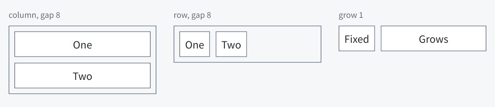
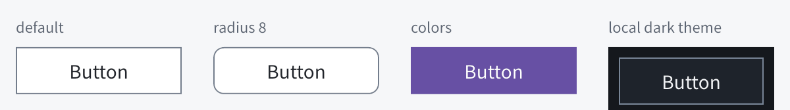
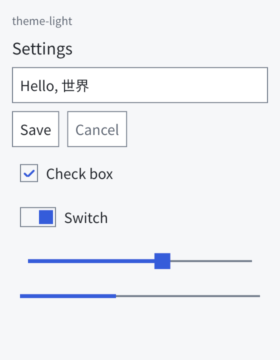
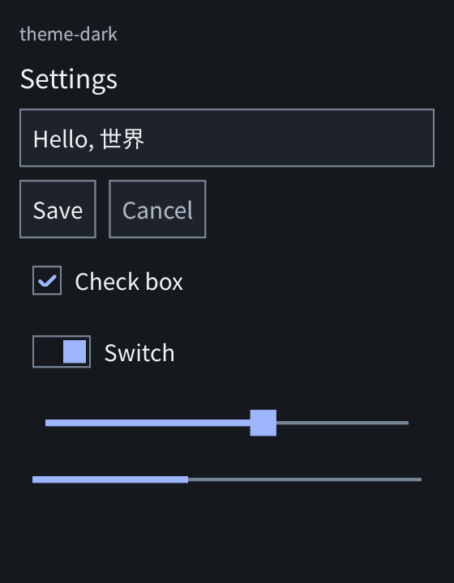
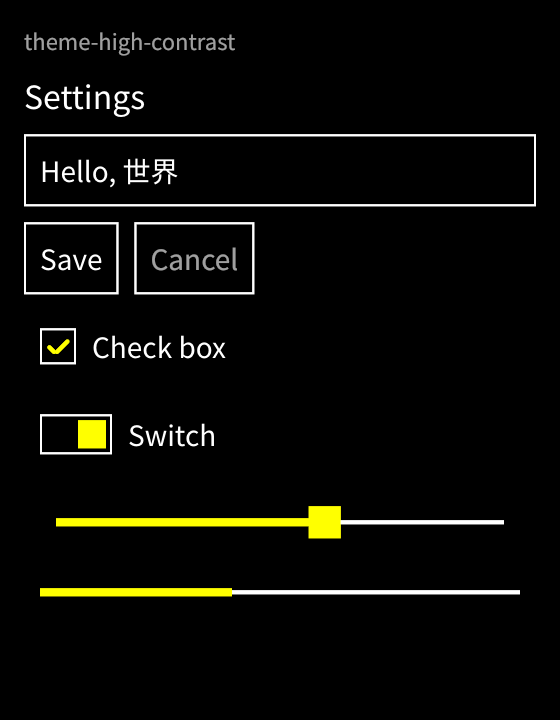

# Aegle 开发者 API 指南

本文面向用 Aegle 编写应用的开发者，按任务介绍当前已实现的接口。各控件的外观、状态和专属方法见[控件参考](controls.md)；设计契约与验证记录分别见 [Rust API 契约](../rust-api.md)、[标记语言](../markup.md)和[实现状态](../implementation.md)。

Aegle 是保留模式 GUI：控件创建一次，之后通过句柄修改，没有每帧重建界面的入口。几乎所有调用都返回 `aegle::Result<T>`（`Result<T, Box<dyn Error>>`），用 `?` 传递即可。

## 1. 依赖与 feature

当前未发布到 crates.io，以 path 或 git 依赖引入 facade crate `aegle`：

```toml
[dependencies]
aegle = { path = "../aegle/crates/aegle" }
```

| feature | 默认 | 作用 |
| --- | :---: | --- |
| `native` | ✓ | 原生窗口：Linux Wayland、Windows Win32（按编译目标选择） |
| `software` | ✓ | CPU 软件绘制 |
| `system-fonts` | ✓ | 系统字体发现（Linux 链接 Fontconfig） |
| `markup` | ✓ | `ui!` 宏与 `aegle::loader` 动态标记引擎 |
| `motion` | ✓ | 外观/位移/缩放旋转过渡、惯性滚动 |
| `effects` | ✓ | `aegle::image::effects`：线性/径向渐变与柔和阴影图像 |
| `colrv1` | ✓ | COLRv1 彩色字形（渐变、变换、混合层） |
| `jpeg` / `webp` / `gif` |  | `aegle::image::decode` 解码 JPEG、WebP（静态）、GIF（首帧） |
| `svg` |  | 静态 SVG（无文字）：`aegle::image::svg` 栅格化，并渲染 OpenType-SVG 字形 |
| `grid` |  | 网格与叠放容器（`grid`、`stack`）及标记的 `Grid`/`Stack`；release 约增加 244 KiB |
| `vulkan` |  | Vulkan 绘制，与 `software` 可同时编译 |
| `wgpu` |  | 全平台通用的最小 wgpu 绘制（几何、文字、图像与路径），可与其他后端同时编译 |
| `accessibility` |  | 语义树导出（`Ui::accessibility`），不接系统 |
| `unix-accessibility` |  | Linux AT-SPI 适配，引入 zbus |
| `windows-accessibility` |  | Windows UI Automation 适配 |

Linux 构建需要 libxkbcommon 开发文件（pkg-config），运行需要 libxkbcommon；启用 `system-fonts` 时还需要 Fontconfig。最小化依赖：`default-features = false` 后按需选择，例如 `features = ["native", "software"]` 并显式注册字体。

## 2. 最小程序

命令式：

```rust
use aegle::prelude::*;

fn main() -> Result<()> {
    let app = App::new()?;
    let window = app.window("Hello")?;
    window.text("你好，世界")?;
    app.run()
}
```

标记（`hello.aegle` 与 `main.rs`，路径相对于包的 `Cargo.toml`）：

```text
Window {
    title: "Hello"
    Text { text: "你好，世界" }
}
```

```rust
fn main() -> aegle::Result<()> {
    aegle::App::run_ui(aegle::ui!("examples/hello.aegle"))
}
```

可运行示例在 `crates/aegle/examples/`：`hello`、`controls`、`widgets`、`components`、`scrolling`、`visuals`、`dynamic` 等，使用 `cargo run -p aegle --example 名称`。

## 3. 应用与窗口

`App` 是主线程上的原生应用，拥有平台连接、共享字体和 renderer；每个窗口有独立的控件树。

```rust
use aegle::prelude::*;

let app = App::with_options(AppOptions {
    app_id: "com.example.notes".into(),
    theme: Theme::light(),
    ..Default::default()
})?;
let window = app.window_with_options("Notes", WindowOptions { width: 640, height: 480, ..Default::default() })?;
```

| 接口 | 说明 |
| --- | --- |
| `App::new()` / `App::with_options(opts)` | 连接平台并发现系统字体（需 `system-fonts`） |
| `App::with_fonts(TextSystem, opts)` | 使用显式字体集合，不做系统发现 |
| `App::run_ui(build)` | 创建 App、调用构造闭包（如 `ui!` 返回的闭包）并运行 |
| `app.window(title)` / `window_with_options(title, opts)` | 新窗口；`Window` 解引用为根 `Container`（列） |
| `app.run()` | 阻塞运行，直到最后一个窗口关闭或回调返回错误 |
| `app.dispatch(Some(timeout))` | 单步运行，供需要自己循环的宿主；返回是否仍有窗口 |
| `app.preferences()` | 最近应用的系统偏好 `Preferences { dark, high_contrast, reduced_motion }` |
| `app.ime_available()` | 平台是否支持原生输入法组合 |
| `window.close()` | 关闭窗口并使其所有控件句柄失效 |
| `window.set_theme(theme)` / `window.set_reduced_motion(b)` | 窗口级主题与减少动态效果 |

`AppOptions` 字段：`app_id`；`theme`、`dark_theme: Option<Theme>`、`high_contrast_theme: Option<Theme>`（按系统偏好选择，`None` 忽略该偏好）；`renderer: RendererBackend`（`Software`/`Vulkan`/`Wgpu`，编译了软件绘制时默认软件）；`vulkan`（Vulkan 预算）；`wgpu`（字形图集尺寸与窗口透明）；`mask_budget`；`transition: Option<Transition>`（交互控件默认过渡，默认 120 ms ease-out）；`reduced_motion: Option<bool>`（`None` 跟随系统）。

`WindowOptions` 字段：`width`、`height`（逻辑像素建议值）、`buffer_budget`（软件呈现字节上限），Linux 另有 `layer: Option<LayerOptions>`，用 wlr layer-shell 创建面板/背景/覆盖层：

```rust
use aegle::{Anchor, KeyboardInteractivity, Layer, LayerOptions};

let panel = app.window_with_options("Panel", WindowOptions {
    height: 32,
    layer: Some(LayerOptions {
        layer: Layer::Top,
        anchor: Anchor::TOP | Anchor::LEFT | Anchor::RIGHT,
        exclusive_zone: 32,
        keyboard: KeyboardInteractivity::None,
    }),
    ..Default::default()
})?;
```

## 4. 控件树与句柄

在 `Container`（列、行、ScrollView 和窗口根）上创建子控件，新控件追加到末尾：

| 方法 | 返回 | 控件 |
| --- | --- | --- |
| `column()` / `row()` | `Container` | 纵向 / 横向容器 |
| `scroll_view()` | `ScrollView` | 可滚动列 |
| `list_view(row_height, count, row)` | `ListView` | 等高虚拟列表 |
| `text(s)` | `Label` | 文本 |
| `button(s)` | `Button` | 按钮 |
| `text_field(s)` / `text_area(s)` | `TextField` | 单行 / 多行编辑器 |
| `check_box(s, checked)` / `switch(s, checked)` | `CheckBox` / `Switch` | 二态控件；复选框可 `set_mixed` 为三态 |
| `radio(s, checked)` | `Radio` | 单选按钮，同一父容器内互斥 |
| `dropdown(items, selected)` | `Dropdown` | 下拉选择 |
| `table(columns, row_height, rows, cell)` | `Table` | 表头加虚拟行的表格 |
| `variable_list_view(estimate, count, row)` | `ListView` | 行高随内容变化的虚拟列表 |
| `slider(min, max, value)` / `progress(min, max, value)` | `Slider` / `Progress` | 数值控件 |
| `image(&Image)` | `ImageView` | 图像 |
| `canvas(painter)` | `Canvas` | 自定义绘制 |

`Image` 是共享的、不可变的 RGBA8 像素（非预乘 sRGB，自上而下）。从文件加载图像用 `aegle::image::decode(&bytes)?`（PNG 总是可用），或用 `aegle::image::png::decode` 取得原始像素；任意色彩类型、调色板、`tRNS` 和 16 位都会转为 RGBA8，伽马与 ICC 块被忽略，默认解码结果不超过 64 MiB（`decode_with_limit` 可调整），宽高不超过 16,384，超限返回 `image::Error::TooLarge`，不是支持的格式返回 `Unsupported`，损坏返回 `Invalid`。

其他格式在可选 feature 后：`aegle::image::decode(&bytes)` 按签名识别 PNG 与已启用的 JPEG/WebP/GIF，返回直接可用的 `Image`（错误为 `image::Error::{Unsupported, Invalid, TooLarge}`，`decode_with_limit` 调整字节预算）；`aegle::image::svg::rasterize(&bytes, width, height)` 把静态 SVG 栅格到指定尺寸，`svg::size` 读取固有尺寸，SVG 文字与外部文件不支持。渐变和阴影用 `aegle::image::effects::{linear_gradient, radial_gradient, shadow}` 生成 `Image`，再用 `image(&image)` 控件或 `Canvas` 里的 `builder.image` 绘制。

所有类型化句柄都解引用为 `Node`，共享以下方法：

| `Node` 方法 | 说明 |
| --- | --- |
| `is_alive()` | 控件是否仍存在 |
| `bounds()` / `visible_bounds()` | 最近刷新后的窗口逻辑坐标 / 与祖先视口的交集 |
| `remove()` / `reparent(&container)` | 删除子树 / 移到另一容器末尾 |
| `set_visible(b)` / `set_enabled(b)` | 作用于整棵子树；隐藏不占布局 |
| `focus()` / `ensure_visible()` | 聚焦 / 滚动祖先使其可见 |
| `set_cursor(Option<Cursor>)` / `cursor()` | 设置/读取该控件及其后代上的鼠标指针形状，`None` 恢复默认 |
| `set_accessible_label(s)` | 无障碍名称 |
| `keep_alive(value)` | 让任意值与控件同生命周期 |
| `popup()` | 创建锚定于该控件的弹出层 `Popup`（`show` / `hide` / `is_shown`） |

**鼠标指针形状**：原生窗口会自动跟随。可用形状见 `Cursor`（`Default`、`Text`、`Pointer`、`Crosshair`、`Move`、`Grab`、`Grabbing`、`NotAllowed`、`ResizeHorizontal`、`ResizeVertical`）。规则按优先级：按下后捕获指针的控件（拖选文字时指针移出字段仍是 I-beam）；鼠标下最上层可见控件上的显式 `set_cursor`；可用的文本字段（含只读，因为文字可选）显示 I-beam，禁用的字段不显示；最近祖先的显式形状；箭头。滚动条条带与拖动滚动条始终是箭头；已显示的弹出层遮住其下方的控件。按钮默认不变手形，这是桌面惯例，需要时对按钮或链接式标签 `set_cursor(Some(Cursor::Pointer))`。Windows 没有抓手光标，`Grab` 用手形、`Grabbing` 用四向箭头。

句柄是弱引用：丢弃句柄不会删除控件；删除控件或关闭窗口后，其句柄的调用返回 `UiError::DeadHandle`。句柄可以克隆后移入回调。

## 5. 布局

布局由 Taffy 计算，规则与 CSS flexbox / grid 相同。行、列的子控件沿主轴排列，交叉轴默认拉伸。长度参数接受 `f32`（逻辑像素）、`Option<f32>`（`None` 为自动）或 `Length::{Px, Percent, Auto}`；百分比相对父内容框，写 0–100。四边参数接受 `f32`、`Length` 或 `Insets::{all, symmetric(水平, 垂直), new(上, 右, 下, 左)}`。非有限值、负尺寸等不合法输入返回 `UiError::InvalidValue`。

| 子项方法（`Node`） | 说明 |
| --- | --- |
| `set_size(w, h)`、`set_width`、`set_height` | 尺寸；自动高度会替换控件的主题高度 |
| `set_min_size(w, h)`、`set_min_width`、`set_min_height` | 最小尺寸；自动表示由内容决定 |
| `set_max_size(w, h)`、`set_max_width`、`set_max_height` | 最大尺寸；自动表示不限 |
| `set_aspect_ratio(Some(r))` | 宽/高比，一边自动时由另一边推出 |
| `set_grow(f)`、`set_shrink(f)`、`set_basis(len)` | 分配剩余空间、空间不足时的收缩比例（默认 1）、增减前的主轴尺寸 |
| `set_align_self(Some(Align))` | 覆盖父容器的交叉轴对齐；网格中为纵向对齐 |
| `set_margin(insets)` | 外边距，可为负；左右都为 `Length::Auto` 时水平居中 |
| `set_absolute(Some(insets))` | 移出流式布局，按父容器内边距框的四边定位并绘制在兄弟之上；`None` 恢复 |
| `set_padding(insets)` | 内边距；容器接受任意四边，文字控件只接受统一像素值 |
| `set_gap(g)`、`set_gaps(水平, 垂直)` | 子控件间距 |

| 容器方法（`Container`） | 说明 |
| --- | --- |
| `row()`、`column()` | 追加行、列 |
| `contents()` | 追加透明分组：其子控件直接参与本容器的行、列、换行或网格布局，可整体显示、隐藏或替换 |
| `set_direction(Direction)` | `Row`、`Column`、`RowReverse`、`ColumnReverse` |
| `set_wrap(Wrap::Wrap)` | 放不下时换行，类似 QML `Flow` |
| `set_align_items(Some(Align))` | 交叉轴对齐：`Start`、`End`、`Center`、`Stretch`、`Baseline`；`None` 恢复拉伸 |
| `set_justify_content(Some(Justify))` | 主轴剩余空间：`Start`、`End`、`Center`、`SpaceBetween`、`SpaceAround`、`SpaceEvenly` |
| `set_align_content(Some(Justify))` | 换行后各行之间（网格中各行之间）的剩余空间 |

```rust
let bar = window.row()?;
bar.set_justify_content(Some(Justify::SpaceBetween))?;
bar.set_align_items(Some(Align::Center))?;
bar.text("标题")?;
bar.button("设置")?;

let tags = window.row()?;
tags.set_wrap(Wrap::Wrap)?;
tags.set_gaps(6.0, 6.0)?;

let fab = window.button("+")?;
fab.set_absolute(Some(Insets::new(Length::Auto, 24.0, 24.0, Length::Auto)))?;
```

**网格与叠放**（facade `grid` feature，release 约增加 244 KiB）：

| 方法 | 说明 |
| --- | --- |
| `grid(&[Track])` | 追加网格，给出列轨道；子控件逐行填入，行不够时自动增加 |
| `stack()` | 追加叠放容器：所有子控件位于同一格并互相覆盖，容器至少与最大的子控件一样大，后加的绘制在上面 |
| `set_columns`、`set_rows`、`set_auto_columns`、`set_auto_rows` | 显式轨道与自动增加的轨道 |
| `set_flow(Flow)`、`set_justify_items(Some(Align))` | 自动放置顺序（`Row`、`Column`、`RowDense`、`ColumnDense`）；子项在格内的水平对齐 |
| `set_grid_column(Placement)`、`set_grid_row(Placement)`、`set_justify_self` | 子项位置：`Placement::at(2)`、`Placement::at(1).spanning(2)`、`Placement::span(2)`；线号从 1 开始，负数从末尾数 |

`Track` 有 `Px`、`Percent`、`Fr`（按份分配剩余空间）、`Auto`、`MinContent`、`MaxContent`、`FitContent(px)` 与 `MinMax(px, fr)`。

```rust
let cards = window.grid(&[Track::Px(160.0), Track::Fr(1.0), Track::Fr(1.0)])?;
cards.set_auto_rows(&[Track::Px(96.0)])?;
let wide = cards.column()?;
wide.set_grid_column(Placement::at(2).spanning(2))?;

let avatar = window.stack()?;
avatar.image(&photo)?;
let badge = avatar.text("3")?;
badge.set_align_self(Some(Align::Start))?;
badge.set_justify_self(Some(Align::End))?;
```

**最小尺寸**：与 CSS flex 一样，容器在主轴上的最小尺寸默认由内容决定。滚动视图、虚拟列表和表格本身可以收缩，但若它们放在一个中间行/列里，要让这个中间容器也能缩小，需对它 `set_min_height(0.0)`（行中为 `set_min_width`）。要让一个内容很多的子项只占剩余空间，用 `set_basis(0.0)` 加 `set_grow(1.0)`，否则它会从完整内容尺寸开始参与收缩。

默认值来自主题：控件高 36、间距 8、窗口根内边距 8，文字 14。显式设置的高度、最小高度、内边距和间距在切换主题后保留。文字按父宽度自动换行。内容超出时放进 `ScrollView` 或 `ListView`。标记中的对应写法见[标记语言](../markup.md)。



## 6. 外观：主题、样式与皮肤

**主题** `Theme` 是一组颜色与尺寸：`background`、`surface`、`foreground`、`muted`、`accent`、`border`、`hover`、`pressed`、`selection`、`font_size`、`padding`、`gap`、`radius`（默认 0，直角）、`control_height`。内置 `Theme::light()`、`dark()`、`high_contrast()`，可修改字段后用 `validate()` 检查。

```rust
window.set_theme(Theme { radius: 6.0, ..Theme::dark() })?;   // 整个窗口
panel.set_theme(Some(Theme::dark()))?;                      // 只作用于 panel 子树
panel.set_theme(None)?;                                     // 恢复继承
// 只替换指定 token，其余跟随父主题（含之后的变化）
panel.set_theme_override(Some(ThemeOverride { accent: Some(Color::rgb(200, 40, 40)), ..Default::default() }))?;
```

原生 `App` 把系统文本缩放（Windows 的文本大小、GNOME 的 `text-scaling-factor`，百分比）应用到解析后主题的 `font_size` 与 `control_height`；`AppOptions.text_scale = Some(125)` 可显式指定，`None`（默认）跟随系统。

**局部样式** 覆盖单个控件，优先于主题和皮肤：`set_background`、`set_foreground`、`set_border_color`、`set_border_width`、`set_radius`、`set_focus_color`、`set_focus_width`、`set_hover_background`、`set_pressed_background`、`set_disabled_background`、`set_disabled_foreground`、`set_selection_color`、`set_caret_color`、`set_indicator_color`，以及字号 `set_font_size` / `clear_font_size`。也可以用 `set_style(Style { .. })` 一次设置，`style()` 读取，`appearance()` 返回当前解析结果。不适用的属性返回 `UiError::WrongKind`。

**皮肤** 是纯函数 `fn(&Theme, VisualState) -> Appearance`，可替换默认外观而不改行为，适合组件库：

```rust
fn primary(theme: &Theme, state: VisualState) -> Appearance {
    let mut look = Appearance::new(theme, state);
    look.radius = 18.0;
    look.border_width = 0.0;
    look.background = if state.pressed { Color::rgb(66, 45, 103) } else { Color::rgb(103, 80, 164) };
    look.foreground = Color::WHITE;
    look
}
button.set_skin(primary)?;
```

`VisualState` 含 `kind`、`enabled`、`hovered`、`pressed`、`focused`、`read_only`、`checked`。



不同主题下的同一组控件：

  

原生 App 默认跟随系统深浅色、高对比与减少动态效果（见第 3 节 `AppOptions`）。高对比主题以对黑底 8:1 的灰色显示禁用和次要文字，与白色的启用控件可区分。

## 7. 事件与回调

```rust
let status = window.text("Ready")?;
let save = window.button("Save")?;
save.on_click(move |_button| status.set_text("Saved"))?;
```

| 控件 | 事件 | 清除 |
| --- | --- | --- |
| `Button` | `on_click(FnMut(Button) -> Result)` | `clear_on_click()` |
| `TextField`（单行） | `on_submit(FnMut(TextField) -> Result)`，Enter 触发 | `clear_on_submit()` |
| `CheckBox` / `Switch` / `Radio` / `Slider` / `Dropdown` | `on_change(FnMut(Self) -> Result)` | `clear_on_change()` |
| 任意控件（`motion`） | `on_transition_end(FnMut(Node) -> Result)` | `clear_on_transition_end()` |
| `Canvas` | `on_input(FnMut(Canvas, CanvasEvent) -> Result)`：指针、滚轮、按键与焦点，见[控件参考](controls.md#canvas) | `clear_on_input()` |

- 回调在本批输入处理后、所有 UI 借用之外执行，可以自由创建、修改或删除控件，包括关闭窗口。
- 回调返回错误时，该处理器被移除，`App::run` 返回此错误并结束。
- 程序 setter（`set_checked`、`set_value`、`set_text` 等）不触发回调，可安全地相互同步；`activate()`、`toggle()`、`increment()`/`decrement()` 模拟用户操作并触发回调。
- 每个控件每种事件只有一个处理器，再次设置会替换。

### 逐帧回调与窗口级按键

```rust
// 播放头：每帧读音频时钟并移动一个小控件；只改 offset，不重新布局或重画时间轴。
playhead.on_frame(move |node, now| {
    let x = audio.position_seconds() * pixels_per_second - scroll;
    node.set_offset(Point::new(x, 0.0))
})?;
playhead.clear_on_frame()?;                      // 停止播放时清除，窗口回到空闲

window.on_key(move |key| {
    if key.pressed && !key.editing && key.key == Key::Character(' ') {
        transport.toggle(key.time);              // key.time：平台报告的按键时刻（Instant）
        return Ok(true);                         // 消费此键，焦点控件不再收到
    }
    Ok(false)
})?;
```

- `Node::on_frame(FnMut(Node, Instant) -> Result)` 每个呈现帧调用一次，按注册顺序，在布局与绘制之前、所有借用之外。只要还有逐帧回调，原生窗口就按显示器节奏持续出帧；全部清除后不再唤醒。控件删除时其回调随之移除；回调出错时被移除并返回错误。
- `Window::on_key` / `Ui::on_key` 在焦点控件和 Tab 遍历之前收到每个按键，返回 `true` 表示已处理。`KeyEvent::editing` 表示焦点在文本编辑器中，此时普通字符键通常应留给输入。处理器出错时被移除。
- 按键与指针事件带有平台时间：Wayland 的毫秒时间戳与 Win32 的 `GetMessageTime` 被映射到 `Instant`（锚定到最小投递延迟，处理 32 位回绕）。窗口按键处理器从 `KeyEvent::time` 读取，自定义控件从 `InputCx::time` 读取；嵌入宿主用 `key_at`、`pointer_at` 传入。

### 后台线程

UI 句柄只能留在 UI 线程。`let proxy = app.proxy(move |message: Job| { label.set_text(&message.text)?; Ok(()) })?;` 返回可克隆、可发送的 `UiProxy<Job>`；任意线程 `proxy.send(job)`（队列上限 1024，满或应用退出时把消息退回）并唤醒事件循环，handler 在 UI 线程于所有借用之外按序运行，可以自由使用其中捕获的控件句柄。

## 8. 过渡与动画（`motion`）

```rust
use std::time::Duration;

card.set_transition(Transition::new(Duration::from_millis(180), Easing::EaseOut))?;
card.set_background(Color::rgb(235, 240, 255))?;      // 外观变化按过渡补间
card.set_offset(Point::new(0.0, 480.0))?;               // 布局后平移，命中与 IME 跟随
card.on_transition_end(move |_| window.close())?;       // 全部过渡完成后执行
```

- 外观过渡覆盖背景、文字、边框、圆角、焦点环、选择、caret 和标志颜色；`presented_appearance()` 返回当前呈现值。
- `finish_transition()` 立即到终点并完成；`cancel_transition()` 停在当前呈现值；`clear_transition()` 移除策略并回到目标。
- `set_offset` 不改变布局；没有过渡策略时立即生效。
- `card.set_transform(Transform { scale: 1.2, rotation: 0.1 })` 以节点中心缩放/旋转子树（弧度，呈现层变换，布局不变），同样可补间；命中、滚动视口裁剪（外包框）、IME 锚点与无障碍变换跟随。
- `ui.fling(position, velocity)` 在触摸板/触摸抬起后继续滚动（逻辑像素/秒，指数衰减），任何新的滚动、按下或 `ui.stop_fling()` 都会停止。
- 手指输入用 `ui.touch(PointerId(..), TouchPhase::Down/Move/Up/Cancel, position, time_ms)`：点击与控件拖动成为指针事件，在非拖动内容上拖动超过 10 px 会平移滚动视图并在抬起时惯性滚动；Wayland 的 `wl_touch` 已接到它。
- 原生 App 为新建的交互控件默认安装 120 ms 过渡；`AppOptions.transition = None` 关闭。减少动态效果时所有过渡直接到终点（仍会触发完成回调）。
- 没有活动动画时不请求帧、不唤醒 CPU。

## 9. 标记语言

`ui!("path.aegle")` 在编译期解析并检查文件，返回构造闭包；`ui!(&parent, "path.aegle")` 立即构造。返回的 View 有 `root` 和每个 `id` 的类型化字段：

```text
Column {
    gap: 8dp
    Text { id: status; text: "Waiting" }
    Button { id: done; text: "Done" }
}
```

```rust
let view = aegle::ui!(&window, "panel.aegle")?;
let status = view.status.clone();
view.done.on_click(move |_| status.set_text("Finished"))?;
```

动态文档可声明 state、表达式绑定、事件块、`if`/`for` 和组件：

```text
use "parts.aegle"
Column {
    state count: int = 0
    Text { text: "count " + str(count) }
    Button { text: "Add"; on clicked { count += 1 } }
    if count > 3 { Text { text: "Many" } }
}
```

View 为根节点的每个 state 提供 `aegle::loader::State<T>` 字段（`view.count.get()`、`view.count.set(5)?`），设置后相关绑定立即更新。运行时加载与重载：

```rust
use aegle::loader::Program;

let mut view = Program::load("ui/panel.aegle")?.build(&window)?;
view.set("count", aegle::loader::Data::Int(2))?;
view.reload(&Program::load("ui/panel.aegle")?)?;   // 失败时保留旧界面
```

还可声明 `record`、写 `for item in items key item.id`、在事件块里用 `let`、`emit` 和 `host.name(args)`（宿主用 `aegle::loader::action(name, &[Type], f)` 或 `Program::action` 注册），组件可有 `slot` 与自己的 `event`。完整语法、可绑定属性、类型规则和限制见[标记语言](../markup.md)。

## 10. 嵌入自有宿主

不使用 `App` 时，可以把无窗口 `Ui` 接到自己的窗口系统和 renderer（`default-features = false` 即可）：

```rust
use aegle::{Theme, TextSystem, Ui, Size};
use std::{cell::RefCell, rc::Rc};

let fonts = Rc::new(RefCell::new(TextSystem::new()));   // 注册应用字体
let ui = Ui::with_fonts(fonts, Theme::light())?;
ui.root().button("OK")?;
ui.resize(Size::new(320.0, 200.0))?;
if ui.refresh()? {
    ui.visit_scenes(|scene, transform, clip| {
        // 交给 renderer：transform 为窗口逻辑平移，clip 为祖先裁剪（必须应用）
        Ok(())
    })?;
}
```

| 输入与同步 | 说明 |
| --- | --- |
| `pointer(id, kind, point, modifiers)`、`pointer_leave()` | 指针移动/按下/释放/离开；`Down`/`Up` 是主键，`ButtonDown`/`ButtonUp(PointerButton)` 是右键、中键与侧键，只交给自定义控件 |
| `cursor()` | 指针当前位置应显示的 `Cursor`；在 `pointer` 与 `refresh` 之后读取，布局变化也会改变它 |
| `key(KeyInput { key, text, modifiers, pressed, repeat })`、`key_at(input, Instant)` | 键盘；`text` 为已翻译文字，先交给 `on_key` 处理器 |
| `pointer_at(id, kind, point, modifiers, Instant)` | 带平台时间的指针事件 |
| `wants_frames()`、`run_frame(Instant)` | 有逐帧回调时每帧调用一次，再 `refresh` |
| `scroll(point, dy)` / `scroll_by(point, delta)`、`wheel(point, delta, modifiers, Instant)` | 滚轮：先给其下取用滚轮的控件（交互 Canvas），再按嵌套视口路由 |
| `window_focus(b)` | 窗口获得/失去键盘焦点 |
| `ime(ImeEdit { .. })`、`ime_left()`、`take_ime_state(max)` | 输入法事务与需要同步给平台的状态 |
| `take_clipboard()` / `paste(text)` | 编辑器发出的复制/粘贴请求 |
| `dispatch_callbacks()` | 执行排队的回调 |
| `advance_animations(now)`、`has_animations()` | 宿主时钟驱动动画 |
| `accessibility(initial, title)`、`access_action(req)` | 语义树导出与动作（需 `accessibility`） |

`crates/aegle/examples/gallery.rs` 是完整的无窗口示例：用软件 renderer 把 `Ui` 渲染成 PNG，本文档的截图即由它生成。

## 11. 错误

`UiError` 变体：`DeadHandle`（控件已删除）、`WrongKind`（操作不适用于该控件）、`ForeignUi`（父子属于不同 Ui）、`InvalidValue`（非有限或越界数值）、`RootMutation`（删除或移动根）、`ReentrantAccess`（在 scene 访问等借用期间修改 Ui）、`IdentityExhausted`。其他错误保留来源类型，例如字体缺失、平台能力缺失、`aegle::loader::RuntimeError`（标记运行时溢出等）和 `aegle::loader::markup::ProgramError`（带文件/行/列的标记诊断）。可用 `error.downcast_ref::<UiError>()` 区分。
