# 默认控件参考

每个默认控件的创建方式、常用方法、事件、标记写法和各状态截图。通用的布局、样式、主题、回调和句柄规则见 [API 指南](api.md)。

截图由 `cargo run -p aegle --example gallery` 生成：每个状态是一个独立的无窗口 `Ui`，经与原生窗口相同的软件 renderer 以 2 倍设备缩放渲染，使用仓库自带的测试字体（Noto Sans CJK 子集）和浅色主题；控件安装与原生 App 相同的默认 120 ms 过渡，在过渡结束后截取，与原生窗口静止时一致。修改控件外观后重新运行该命令即可更新本页图片。

默认外观是中性直角风格：边框 1 dp，焦点环 2 dp 使用主题 `accent`；悬停和按下使用主题 `hover`/`pressed` 底色；禁用时文字使用 `muted`。焦点环只在键盘焦点时出现：指针按下获得的焦点不显示（编辑器除外），之后任一按键恢复显示。所有控件都可以用局部样式、皮肤或主题修改外观，见 [API 指南第 6 节](api.md#6-外观主题样式与皮肤)。

| 控件 | Rust 创建 | 标记 |
| --- | --- | --- |
| [Text](#text) | `text(s) -> Label` | `Text` |
| [Button](#button) | `button(s) -> Button` | `Button` |
| [TextField / TextArea](#textfield--textarea) | `text_field(s)` / `text_area(s) -> TextField` | `TextField` / `TextArea` |
| [CheckBox](#checkbox) | `check_box(s, checked) -> CheckBox` | `CheckBox` |
| [Switch](#switch) | `switch(s, checked) -> Switch` | `Switch` |
| [Radio](#radio) | `radio(s, checked) -> Radio` | `RadioButton` |
| [Dropdown](#dropdown) | `dropdown(items, selected) -> Dropdown` | — |
| [Popup](#popup) | `node.popup() -> Popup` | — |
| [Menu / MenuBar](#menu--menubar) | `node.menu()` / `node.context_menu() -> Menu`，`menu_bar() -> MenuBar` | — |
| [Slider](#slider) | `slider(min, max, value) -> Slider` | `Slider` |
| [Progress](#progress) | `progress(min, max, value) -> Progress` | `Progress` |
| [Column / Row](#column--row) | `column()` / `row() -> Container` | `Column` / `Row` |
| [ScrollView](#scrollview) | `scroll_view() -> ScrollView` | `ScrollView` |
| [ListView](#listview) | `list_view(h, n, row) -> ListView`（`h` 为行高或 `RowHeight::Estimate(估计)`） | — |
| [Table](#table) | `table(columns, h, n, cell) -> Table` | — |
| [ImageView](#imageview) | `image(&Image) -> ImageView` | — |
| [Canvas](#canvas) | `canvas(painter) -> Canvas` | — |

## Text

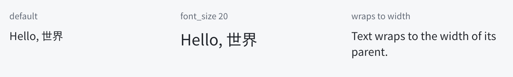

```rust
let title = window.text("Hello, 世界");
title.set_font_size(20.0);
title.set_text("新的文字");
```

```text
Text { text: "Hello, 世界"; font_size: 20dp }
```

- 方法：`set_text`、`text`、`set_font_size`（`None` 回到主题字号）、`set_foreground`。
- 按父容器宽度自动换行；默认无内边距，不可聚焦，不压缩高度。
- 无障碍角色 Label，值为文字内容。

## Button

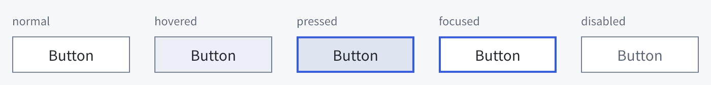

```rust
let save = window.button("Save");
save.on_click(|button| button.set_text("Saved"));
save.activate();            // 按用户激活的规则排队回调
```

```text
Button { id: save; text: "Save"; on clicked { saved = true } }
```

- 方法：`set_text`、`on_click`、`activate`。
- 指针在按钮上按下并在按钮上释放才激活；Space 在释放时激活，Enter 在首次按下时激活，按键重复不重复触发。失焦、禁用或指针取消时不激活。
- 默认高度为主题 `control_height`（36），宽度为文字加两侧内边距；`set_width`、`set_grow` 可改变。
- 无障碍角色 Button，名称默认为按钮文字，支持 Focus/Click 动作。

## TextField / TextArea

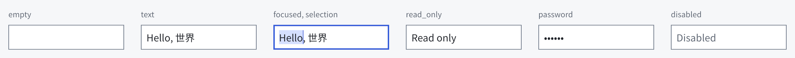

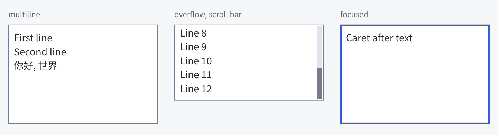

```rust
let name = window.text_field("");
name.on_submit(|field| {
    println!("submitted {}", field.text());
});
let notes = window.text_area("First line\nSecond line");
notes.select(aegle::ui::Selection { anchor: 0, focus: 5 });
let secret = window.text_field("");
secret.set_password(true);
```

```text
TextField { id: name; text: ""; on submitted { submitted = self.text } }
TextArea { text: "First line\nSecond line"; read_only: true }
```

- 方法：`text`、`set_text`（清空撤销历史并结束输入法预编辑）、`select(Selection)`（UTF-8 字节偏移；与 `set_text` 一样先结束进行中的输入法组合）、`set_read_only`、`set_password`、`on_submit`（仅单行，Enter 触发）。
- 编辑：选择、按词/行移动、按字素删除、撤销/重做（Ctrl+Z / Ctrl+Y）、全选（Ctrl+A）、复制/剪切/粘贴（Ctrl+C / X / V，macOS 用 Cmd）；原生宿主处理剪贴板，自有宿主用 `take_clipboard` / `paste`。
- 输入法：Wayland text-input-v3、Windows IMM；预编辑不改变已提交的值。
- 只读可选择和复制；密码模式显示 `•`，拒绝复制、输入法组合并不保留撤销历史。
- 默认高度：单行为 `control_height`，多行为其 4 倍；多行内容溢出时显示覆盖式纵向滚动条，caret 移动会自动滚动到可见。
- 无障碍角色 TextInput / MultilineTextInput / PasswordInput，导出文字与选择。

## CheckBox

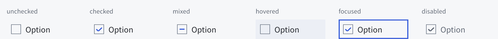

```rust
let agree = window.check_box("I agree", false);
agree.on_change(|control| {
    println!("checked: {}", control.is_checked());
});
agree.set_checked(true);   // 程序设置，不触发 on_change
agree.set_mixed(true);     // 部分选中（三态）
```

```text
CheckBox { text: "I agree"; checked: agree; on changed { agree = self.checked } }
```

- 方法：`is_checked`、`set_checked`、`is_mixed`、`set_mixed`、`toggle`（按用户操作规则切换并触发回调）、`text`、`set_text`、`on_change`。
- 标志 18 dp，选中绘制对勾、部分选中绘制横线，不只依靠颜色区分；激活规则与 Button 相同。用户从部分选中状态切换后变为选中；`set_checked` 也会结束部分选中。标记写 `mixed: true`。
- 无障碍角色 CheckBox，Toggled 为 True / False / Mixed。

## Switch

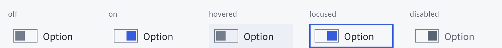

```rust
let wifi = window.switch("Wi-Fi", true);
wifi.on_change(|control| {
    println!("on: {}", control.is_checked());
});
```

```text
Switch { text: "Wi-Fi"; checked: true }
```

- 方法与 CheckBox 相同。开关 36×20 dp，滑块位置表示状态：开在右侧，关在左侧。
- 无障碍角色 Switch。

## Radio

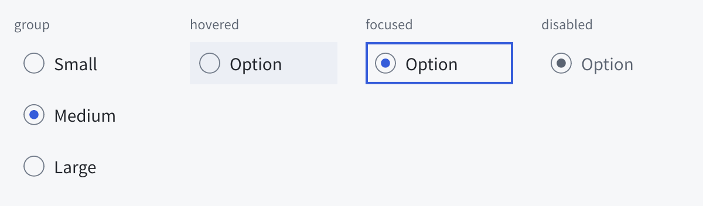

```rust
let size = window.row();
size.radio("Small", false);
let medium = size.radio("Medium", true);
size.radio("Large", false);
medium.on_change(|radio| {
    println!("medium chosen: {}", radio.is_checked());
});
```

```text
Row { RadioButton { text: "Small" }; RadioButton { text: "Medium"; checked: true } }
```

- 同一父容器中的单选按钮构成一组：用户或 `set_checked(true)` 选中一个时其余取消。再次激活已选中的按钮不产生变化。
- 方法与 CheckBox 相同（无 mixed）；`on_change` 只在该按钮被用户选中时触发。
- 聚焦时方向键在组内移动并选择上一个/下一个可用按钮（循环）。
- 圆形标志 18 dp，选中时绘制实心圆点，与方形复选框可按形状区分。无障碍角色 RadioButton。

## Slider

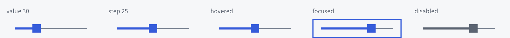

```rust
let volume = window.slider(0.0, 100.0, 30.0);
volume.set_step(5.0);
volume.on_change(|slider| {
    println!("value: {}", slider.value());
});
```

```text
Slider { min: 0; max: 100; value: 30; step: 5; on changed { volume = self.value } }
```

- 方法：`value`、`range`、`set_value`、`set_range`、`step`、`set_step`（0 为连续）、`increment` / `decrement`、`on_change`。越界的有限值会被限制到范围内。
- 键盘：方向键移动一步（连续时为跨度的 1%），PageUp/PageDown 十步（或 10%），Home/End 到端点。指针按下轨道直接设值并可拖动。
- 手柄 16 dp，轨道 2 dp，已完成部分 4 dp；宽度不足时缩小。
- 无障碍角色 Slider，带数值、范围与步长。

## Progress

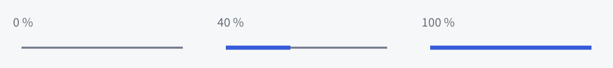

```rust
let download = window.progress(0.0, 100.0, 0.0);
download.set_value(40.0);
```

```text
Progress { min: 0; max: 100; value: 40 }
```

- 方法：`value`、`range`、`set_value`、`set_range`。只显示确定进度，不可聚焦、不接受用户调整，没有不确定进度动画。
- 默认高度为 `control_height` 的一半。无障碍角色 ProgressIndicator，带数值。

## Column / Row


```rust
let form = window.column();
form.set_gap(12.0, 12.0);
form.set_padding(16.0);
let actions = form.row();
actions.button("Cancel");
actions.button("OK").set_grow(1.0);
```

```text
Column { gap: 12dp; padding: 16dp
    Row { Button { text: "Cancel" }; Button { text: "OK"; grow: 1 } }
}
```

- 纵向 / 横向排列子控件，默认间距为主题 `gap`（8），交叉轴拉伸。窗口根就是一个列。
- 容器默认透明、无边框；可以设置背景、边框、圆角和局部主题，但圆角不裁剪子控件。

## ScrollView

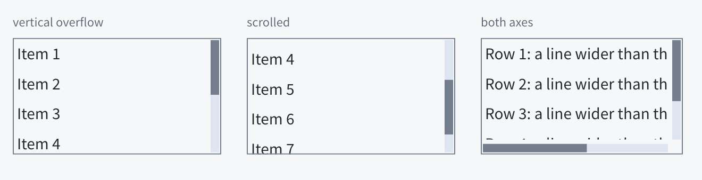

```rust
let list = window.scroll_view();
list.set_height(Some(200.0));
for i in 1..=50 {
    list.text(&format!("Item {i}"));
}
list.scroll_to(Point::new(0.0, 120.0));
```

```text
ScrollView { height: 200dp
    Text { text: "Item 1" }
    Text { text: "Item 2" }
}
```

- 默认透明背景、1 dp 主题边框（圆角随主题 radius），内边距为主题 padding 的一半；可用 `set_border_width(0.0)`、`set_padding` 覆盖。ListView 继承同样外观，Table 内的行列表不另加边框。
- 内部按列排列；限制高度/宽度或 flex 分配后，超出部分可滚动，两轴均支持。
- 方法：`offset`、`max_offset`、`content_size`、`scroll_to`、`scroll_by`；子控件用 `ensure_visible` 滚动到可见，`visible_bounds` 读取可见区域。
- 滚轮、Tab 焦点和 caret 移动都会滚动；嵌套视口会把未消费的滚动传给外层。
- 溢出时在边缘绘制滚动条：12 dp 指针带内是贴外缘的轨道与胶囊形滑块，静止时 4 dp 粗，视图悬停或拖动滑块时 8 dp；两端让开视图的圆角，滑块长度表示可见比例；可拖动滑块或点击轨道定位。轨道与滑块颜色取自外观的 `scrollbar` 字段（轨道、静止滑块、悬停或拖动时的滑块），默认为主题的 pressed、border 与 muted，皮肤可整体替换。溢出的一侧会在内边距之外为滚动条留出 14 dp（轨道、边距和 4 dp 间隙），内容也不会滚到滚动条下面：纵向溢出时右侧留白并在该处裁剪，横向溢出时底部同理；没有溢出时只占用内边距。边框画在子内容之后，滚到边缘的内容不会盖住它。
- 无障碍角色 ScrollView，带滚动偏移与范围。

## ListView

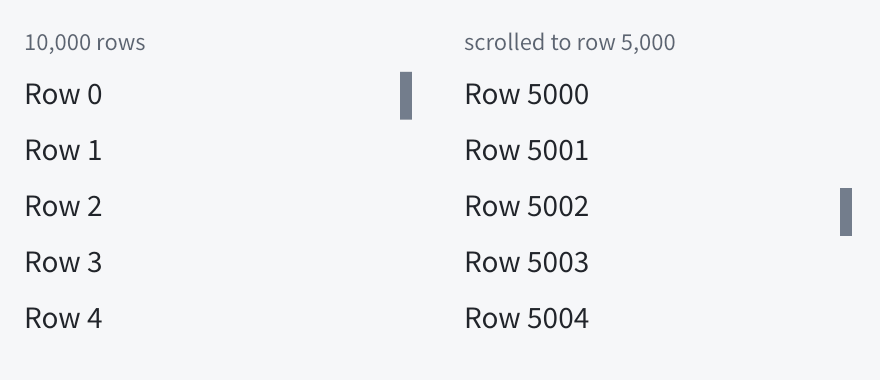

```rust
let rows = window.list_view(28.0, 10_000, |row, index| {
    row.text(&format!("Row {index}"));
});
rows.set_height(Some(300.0));
rows.set_count(20_000);   // 行数变化
rows.reload();            // 行数据变化，重建已显示的行
```

- 等高虚拟列表：只有与可见区域相交的行真正存在，滚出的行被删除，进入的行调用回调重建。一万行首次刷新约 0.24 ms，内存增长约 1 MB。
- `ListView` 解引用为 `ScrollView`，滚动接口和滚动条相同；另有 `count`、`set_count`、`row_height`、`reload`。
- 回调在刷新期间、UI 借用之外执行，可以使用任意句柄；行内状态在行滚出后丢失，应保存在应用数据中。
- `行高 × 行数` 不超过 16,777,216。

行高随内容变化时把行高写成 `RowHeight::Estimate(估计行高)`：未显示的行按估计值占位，显示后测量实际高度并移动后续行；估计值被替换时滚动位置可能轻微跳动。

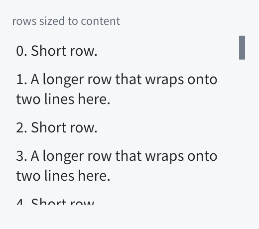

```rust
let notes = window.list_view(RowHeight::Estimate(24.0), 500, move |row, index| {
    row.text(&messages[index]);
});
```

## Table

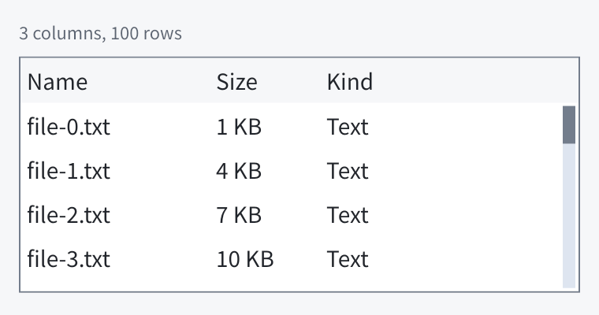

```rust
let columns = [
    TableColumn { title: "Name", width: Some(120.0) },
    TableColumn { title: "Size", width: None },   // 占剩余宽度
];
let table = window.table(&columns, 28.0, 100, |cell, row, column| {
    cell.text(&format!("{row}:{column}"));
});
table.set_height(Some(240.0));
table.rows().set_count(200);
```

- 带边框的表头行加等高虚拟行（基于 ListView）；`fill(cell, row, column)` 在行进入可见区域时填充单元格列，可放任意控件。`rows()` 返回行列表，用于 `set_count`、`reload` 和滚动。
- 表格的最小高度不随行数增长，可以收缩到父容器给它的空间；与其他控件分享剩余空间时用 `set_basis(0.0)` 加 `set_grow(1.0)`，见 [API 指南的最小尺寸说明](api.md#5-布局)。表格、表头和弹出列表的背景按当前主题解析，切换主题后随之更新。
- 无障碍角色 Table / Row / Cell / ColumnHeader。不内置排序、列宽拖动或单元格选择，可在表头和单元格中放按钮实现。

## Dropdown

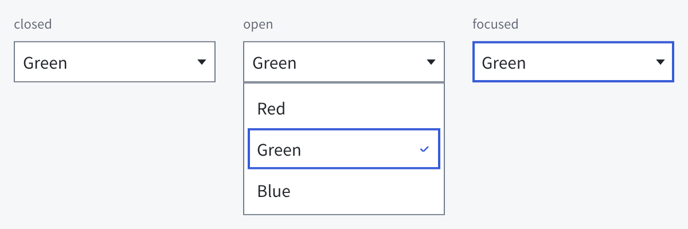

```rust
let color = window.dropdown(&["Red", "Green", "Blue"], 1);
color.on_change(|dropdown| {
    println!("chosen {}", dropdown.selected());
});
color.set_items(&["One", "Two"], 0);   // 程序设置，不触发 on_change
```

- 按钮显示当前选项和下拉箭头；激活（点击、Space、Enter）在下方弹出选项列表，焦点位于当前选项，当前选项带对勾。Up/Down 移动，Enter 或点击选择并关闭；Escape 或点击外部关闭且不改变选择。
- 方法：`selected`、`set_selected`、`items`、`set_items`、`on_change`。
- 无障碍角色 ComboBox（带展开状态）、ListBox 与 ListBoxOption（带选中状态）。

## Popup

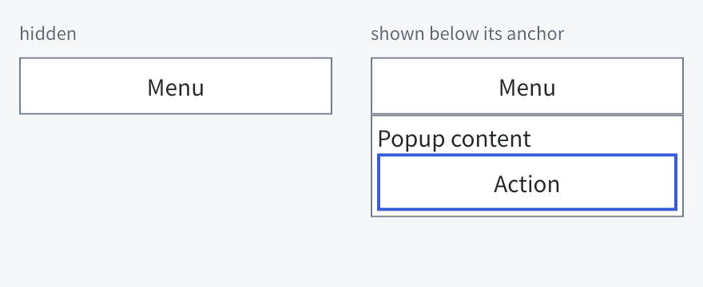

```rust
let menu = window.button("Menu");
let popup = menu.popup();
popup.text("Popup content");
popup.button("Action");
let shown = popup.clone();
menu.on_click(move |_| if shown.is_shown() { shown.hide() } else { shown.show() });
```

- 任意控件可用 `popup()` 创建锚定于自己的弹出层：一个可添加任意子控件的列，默认隐藏。
- `show()` 时显示在锚点下方（空间不足时在上方）、至少与锚点同宽，绘制在窗口全部内容之上并优先命中，焦点移到其第一个可用控件；不占布局空间，只在当前窗口内显示。`show_at(point)` 把起始角放在窗口逻辑坐标点上，放不下时翻到另一侧再夹在窗口内；这样显示时按下锚点区域也会关闭它。`anchor()` 返回锚点控件。
- Escape 或按下其外部（锚点除外）时隐藏，焦点回到打开前的位置；Up/Down 在其中移动焦点。隐藏时一并隐藏锚定在其内部的弹出层。删除锚点会一并删除弹出层。

## Menu / MenuBar

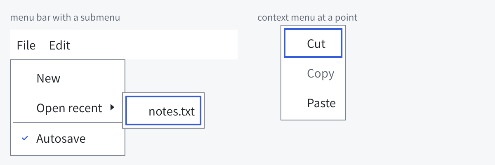

```rust
let bar = window.menu_bar();
let file = bar.menu("File");
file.item("Open").on_click(|_| open());
let recent = file.submenu("Open recent");
recent.item("notes.txt");
file.separator();
let autosave = file.check_item("Autosave", true);
autosave.on_click(|item| set_autosave(item.is_checked()));
file.item("Save").set_shortcut(Some("Ctrl+S")); // 只是提示，按键由应用绑定
file.separator();
let small = file.radio_item("Small icons", true);   // 相邻的单选项为一组
file.radio_item("Large icons", false);

let editor = window.text_area("");
let context = editor.context_menu();      // 右键、Menu 键、Shift+F10
context.item("Paste");
```

- `Menu` 是角色为菜单的 Popup：`item(text)`、`check_item(text, checked)`、`radio_item(text, checked)`、`submenu(text) -> Menu`、`separator()`，也可以放任意控件。相邻的单选项构成一组，分隔线或其他种类的项开始新组；选择单选项会勾选它并取消同组其他项，再次选择已勾选的项保持勾选。`node.menu()` 显示在锚点下方，由应用调用 `show()`（如在按钮的 `on_click` 中）；`node.context_menu()` 在该控件或其后代请求上下文菜单时于请求点 `show_at`。
- `MenuItem`：`on_click`、`set_text`、`set_shortcut`、`is_checked` / `set_checked`（单选项勾选时取消同组其他项）、`activate`，以及 `set_enabled` 等通用方法。选择一项会先关闭所有菜单、切换勾选或单选项，再按注册顺序运行处理器；打开子菜单的项不运行处理器。子菜单的打开项是 `submenu.anchor()`。
- 键盘：Up/Down 在项间移动并跳过分隔线和禁用项，Home/End 到两端，Right 打开子菜单并聚焦其第一项（从右到左时为 Left），Left 或 Escape 关闭子菜单回到打开项，Enter/Space 选择。指针停在项上即聚焦它并打开其子菜单，同时关闭同级的子菜单。子菜单显示在打开项的结束一侧并与其顶端对齐，放不下时换到另一侧。
- `MenuBar` 是一行入口，`menu(text)` 添加入口并返回其菜单。点击入口打开或关闭菜单；某个菜单打开时指针移到另一个入口即切换；焦点在入口上时 Left/Right 移动、Down 打开；菜单内 Left/Right 移到相邻菜单。F10 聚焦第一个菜单栏的第一个入口。
- 每项预留勾选列（单选项画圆点）。`set_shortcut(Some("Ctrl+S"))` 在项尾以次要文字色显示快捷键提示，随主题字号与字体变化，并作为无障碍键盘快捷键导出；它不注册按键，应用自己处理快捷键。
- 无障碍角色 Menu、MenuBar、MenuItem、MenuItemCheckBox 与 MenuItemRadio（后两者带勾选状态）；打开子菜单的项报告有菜单弹出及展开状态。有上下文菜单的控件导出 ShowContextMenu 动作。

## ImageView

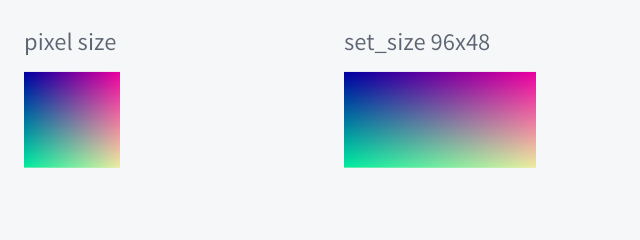

```rust
use aegle::ui::scene::Image;

let pixels = vec![255u8; 48 * 48 * 4];             // 非预乘 sRGB RGBA8，首行在前
let image = Image::new(48, 48, pixels)?;
let view = window.image(&image);
view.set_width(96.0);                             // 按边界拉伸，不保持宽高比
view.set_height(48.0);
```

- 默认尺寸为图像像素尺寸（逻辑像素），交叉轴不拉伸。`image()` 读取、`set_image()` 替换。
- `Image` 克隆共享像素；renderer 按图像 id 缓存上传结果。应用自行解码 PNG/JPEG。
- 无障碍角色 Image，名称用 `set_accessible_label` 设置。

## Canvas

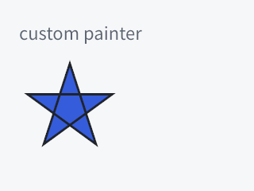

```rust
use aegle::ui::scene::{Color, FillRule, PathBuilder, Point};

let canvas = window.canvas(|builder, size| {
    let mut path = PathBuilder::new();
    path.move_to(Point::new(0.0, 0.0));
    path.line_to(Point::new(size.width, size.height));
    path.line_to(Point::new(0.0, size.height));
    path.close();
    builder.fill_path(&path.finish(FillRule::NonZero)?, Color::rgb(53, 92, 218))?;
    Ok(())
});
canvas.set_width(64.0);
canvas.set_height(64.0);
canvas.invalidate();   // 数据变化后重新绘制
```

- painter 用局部坐标和当前尺寸录制 scene 命令（矩形、圆角、边框、路径、图像、变换、裁剪），只在创建、尺寸变化、`invalidate` 或 `set_painter` 后重新执行，不按帧调用。
- painter 运行时持有 UI 借用，不能使用控件句柄；默认尺寸为零，需设置尺寸或 grow；绘制不裁剪到边界。
- 默认只绘制、不接收输入；无障碍角色 Canvas。

**GPU 纹理**：painter 里 `builder.texture(id, rect)` 绘制应用自己渲染的 GPU 纹理（游戏画面、3D 预览）。wgpu 后端：`app.wgpu()` 给出共享设备，在其上创建 `TEXTURE_BINDING` 纹理并 `register_texture` 得到 `TextureId`；每帧在 `on_frame` 里向同一队列提交渲染命令即可，完整示例见 `cargo run -p aegle --features wgpu --example gpu_texture`。Vulkan 后端用 `app.vulkan()` 的 `raw_device()` 与 unsafe `register_texture(view, extent)`。软件后端不支持应用纹理，画到它会使帧失败（`UnsupportedCommand`）。

**交互**：`set_input` 让 Canvas 成为可聚焦的交互控件，适合时间轴、谱面、曲线编辑器等需要自绘又要处理输入的场景：

```rust
canvas.set_input(move |canvas, event| {
    match event {
        CanvasEvent::Press { position, modifiers, .. } => editor.begin(position, modifiers),
        CanvasEvent::Move { position, pressed: true, .. } => editor.drag(position),
        CanvasEvent::Release { .. } | CanvasEvent::Cancel => editor.end(),
        CanvasEvent::ButtonPress { button: PointerButton::Secondary, position, .. } => editor.context_menu(position),
        CanvasEvent::Wheel { delta, modifiers, position, .. } if modifiers.control => editor.zoom(position, delta.y),
        CanvasEvent::Wheel { delta, .. } => editor.scroll(delta),
        CanvasEvent::Key { key: Key::Delete, pressed: true, .. } => editor.delete_selection(),
        _ => {}
    }
    canvas.invalidate()
});
```

- 事件坐标是 Canvas 的局部逻辑坐标，带平台时间 `time`。按下时获得焦点并捕获指针，之后的 `Move { pressed: true }` 与 `Release` 即使在 Canvas 外也会送达；未按下时的移动是 `Move { pressed: false }`，离开是 `Leave`；捕获丢失为 `Cancel`。
- 右键、中键与侧键（`PointerButton::{Secondary, Middle, Back, Forward}`）作为 `ButtonPress`/`ButtonRelease { button, .. }` 送达，同样获得焦点并捕获指针，直到在 Canvas 上按下的所有按键都释放；`Move` 的 `pressed` 只表示主键，按住其他键拖动（如中键平移）时用自己记录的按键状态。默认控件忽略这些按键。
- 鼠标滚轮与触控板滚动先交给其下的交互 Canvas 并被消费，外层 ScrollView 不滚动；惯性滚动只作用于滚动视图。
- 获得焦点时有焦点框并加入 Tab 顺序，聚焦时收到全部按键（Tab 仍用于切换焦点）；`Focus(bool)` 报告焦点变化。
- 同一批输入的事件按顺序在该批之后、所有借用之外交给回调，回调里可以修改任意控件。输入回调是画布自身的行为，与 `set_painter` 一样，再次设置会替换。

## 已知限制

- 弹出层只在所属窗口内显示，不越过窗口边缘。
- 没有富文本编辑器和完整 MD3 组件集；可用现有控件、皮肤与 Canvas 组合。
