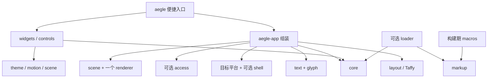

# 模块、依赖与构建组合

状态：v0.1 模块设计。types、core、layout、scene、text、glyph、controls、access、theme、motion、app、markup、macros、便捷入口、软件 renderer 与 Wayland 平台已建立；实际覆盖范围见下文。其余模块及已建立模块的完整职责仍是设计目标，验证记录见[实现状态](implementation.md)。

## 拆分尺度

按可独立使用的能力和真实后端差异拆分。每个模块需有自己的 Interface：类型、所有权、调用顺序、错误和资源成本。模块不通过全局服务定位器寻找其他模块，由调用者显式传入能力。

| crate | 责任及独立用途 | Aegle 内部依赖 |
| --- | --- | --- |
| aegle-types | 几何、颜色、资源 ID、通用错误与能力描述；无平台依赖 | 无 |
| aegle-core | 槽位树、句柄、属性变更、事件路由、焦点 | types |
| aegle-layout | Taffy 低层树适配、Flex/Block 与可选 Grid；不依赖应用 | types、core |
| aegle-text | 字体、保留段落布局、纯文本编辑/组合状态与有界撤销 | types；scene 按 feature 接入 |
| aegle-glyph | Swash 字形光栅化与有界 CPU 字形缓存 | 无 |
| aegle-scene | 二维绘制命令、裁剪及可选字形记录 | types |
| aegle-render-vulkan | Vulkan 实现、上传、图集与呈现 | types、scene |
| aegle-render-software | 无 GPU 栅格绘制，与 GPU 共用 scene/文字资源 | types、scene；glyph 按 text feature 接入 |
| aegle-render-metal | Metal 实现、上传、图集与呈现 | types、scene |
| aegle-platform-wayland | Wayland 窗口、事件、IME、输出与平台偏好 | types |
| aegle-platform-win32 | Win32 窗口、TSF/必要兼容路径及平台偏好 | types |
| aegle-platform-appkit | AppKit 窗口、NSTextInputClient 及平台偏好 | types |
| aegle-shell-wayland | layer-shell 表面策略，共享 Wayland 连接和事件队列 | types、platform-wayland |
| aegle-access | 原生回调排队/唤醒与可选 AccessKit adapter；宿主派生语义更新 | 无内部依赖；schema 为 AccessKit，unix 显式启用 |
| aegle-theme | 无分配的 Theme、视觉状态、Appearance/Style 和纯函数 Skin；局部 token 继承与命名空间扩展是后续目标 | types |
| aegle-motion | 时间、补间、过渡及可选弹簧；可无窗口独立推进 | types |
| aegle-controls | 可复用控件行为、语义动作与基础组合；无默认皮肤 | types；text feature 接 text，树与路由由宿主提供 |
| aegle-widgets | 默认中性极简皮肤和常用组件 | controls、theme、scene；motion 按 feature 接入 |
| aegle-path | Lyon 路径细分，可交给其他绘制宿主 | types、scene |
| aegle-assets | 有界 PNG 解码与可选运行时 SVG 光栅化 | types |
| aegle-markup | 有界静态结构解析、跨度、内建控件 schema 与类型化构造计划 | 无 |
| aegle-macros | ui! 文件编译与有类型 View 生成，仅编译期运行；组件元数据仍为目标 | markup |
| aegle-loader | 可选运行时加载、表达式执行与显式重载 | types、markup、core |
| aegle-app | 无窗口 Ui 与可选原生 App，连接保留控件、布局、绘制、文本、主题及语义 | types、core、layout、scene、text、controls、theme；平台/renderer/access 按 feature |
| aegle | 应用便捷入口与重导出，不提供另一套实现 | app；其他按 feature 重导出 |

表中的简称指同名前缀 crate。文字无障碍为 `aegle-text/text-a11y`，映射 Parley 的可选 AccessKit 支持；基础文字模块不强制启用它。平台 adapters 按 target 编译，不能把三平台实现都塞进一个程序。

当前 `aegle-scene` 使用 no_std + alloc，默认只依赖 types；`text` 仅增加轻量的 `linebender_resource_handle`，通过共享 `FontData` 及独立 run 旁表保存字形记录，不引入 Parley 或 Swash。纯几何命令不携带完整字体/run 数据。

`aegle-render-software` 借用调用方像素缓冲，不依赖 core、Taffy 或窗口；默认是纯几何构建，没有字体栈和 PNG 运行依赖。tiny-skia 0.12（仅 std/simd）完成覆盖率栅格化，小型自有实现完成线性光 SourceOver。`text` 显式增加 aegle-glyph，其 PNG 解码器用于字体内嵌位图。软件后端不依赖 aegle-text，其他 shaping 宿主也可提供 scene 字形记录。

`aegle-text` 默认启用 Parley std，并复用其已有的 ICU 分段包处理 grapheme 删除；系统字体、词典、文字无障碍和 scene 桥接分别可选。段落与 Editor 共用 TextSystem 字体/shaping 上下文，Editor 包装 PlainEditor 并补充稳定提交值、可取消组合和有界 delta 历史；不另建编辑引擎或转发 crate。scene 桥接共用字形绘制，额外记录选择、预编辑和光标；平台 IME、剪贴板及系统语义由后续平台/应用层连接。

`aegle-glyph` 独立接受共享字体句柄，复用 Swash、Skrifa、hashbrown 与 lru-slab，不自建字体解析器或通用缓存框架。缓存不保留字体字节；段落、编辑器及 scene 的字体句柄维持各自资源寿命。

`aegle-platform-wayland` 复用 SCTK、wayland-client 与 calloop 管理同一连接、多个普通窗口和原生输入。平台只依赖 types；TextSystem、Editor、Scene 和 renderer 在可执行示例中组合，不成为平台的发布依赖。软件呈现直接借出有界 SHM 像素；text-input-v3 以带 seat 身份的事务传递给宿主。尚未实现 layer-shell 或 GPU surface 接口。

`aegle-controls` 默认只有无分配的 Button 状态及借用 Input/Outcome；`text` 增加复用 Editor 的 TextField。它不依赖 core、布局、主题、renderer 或窗口。宿主在自己的树中保存行为状态，负责命中、焦点和 capture；键盘、指针及语义激活经过同一默认行为。Wayland editor 示例使用 core 的 Route/Focus 连接这套行为，不再另写编辑快捷键与 IME 文本替换。可选 aegle-access/unix 已在示例接通 AT-SPI 的查询、焦点、按钮及文字选择，完整系统无障碍仍未完成。

`aegle-access` 的 Mailbox/Handlers 将原生线程上的请求交给宿主自己的 UI 线程，不引入另一棵应用树。UnixAdapter 复用 AccessKit 的系统协议与语义缓存，收到初次请求时完整导出，其后按脏标记更新。text-a11y 文本桥补充 run 身份/范围校验；平台、控件和文字依赖仍可分开选择。

`aegle-theme` 是 no_std、无分配的小型值类型，只依赖 types。`Theme` 提供浅色、深色和高对比配色以及正文、间距、圆角和控件高度；Appearance/Style 按控件状态解析独立于行为的外观，Skin 是纯函数指针；自定义值在宿主接受时验证。app 用稀疏表保存本地外观和字号，不把完整 Style 放进每个节点。当前没有主题注册表或系统偏好监听；可选过渡由 app 连接独立 motion 模块。

`aegle-app` 默认不创建平台依赖，但包含当前 Ui 所需的文字、布局和基础控件。`Ui::with_fonts` 接受可共享的 TextSystem，拥有一棵控件树；提供 row/column、标签、按钮、单行/多行文本编辑和弱句柄。平台宿主可分别调用输入、刷新、scene 遍历、IME 和可选语义接口。`wayland` 在 Linux 增加原生 App 与软件呈现；各窗口独立拥有 Ui，共享连接、字体和 renderer。当前基础皮肤和纯函数皮肤由 app 应用到现有控件；尚未抽出独立 widgets crate，出现更多真实行为/绘制消费者时再形成该模块。

`aegle` 重导出 app，不复制实现。当前默认 `desktop` 组合是 **Linux Wayland + 软件绘制 + 系统字体 + Unix 无障碍 + 编译型静态标记 + 外观过渡**，不是下表的目标 GPU 组合。`aegle-app` 的 `accessibility` 仅启用语义树导出，`unix-accessibility` 另接系统 adapter；`system-fonts` 可关闭并改用显式字体。当前 facade 的 `default-features = false` 仍保留 Ui 的文字等基本依赖；需要更小的单一能力时直接选择底层 crate。Windows/macOS 原生宿主、GPU、动态标记与几何动画仍待实现。

`aegle-markup` 是无第三方依赖的有界解析器和静态 schema；不依赖 app 或任何平台，可供外部工具独立检查。`aegle-macros` 复用它，并用 syn/quote/proc-macro-crate 处理 Rust 宏参数、代码生成与依赖别名，避免自建 Rust 语法处理。facade 的可选 `markup` 只增加编译期宏；生成代码直接创建相同保留控件，发布程序不带解析器、AST 或字符串控件注册表。运行时 loader 和第三方组件导入仍未实现。

`aegle-motion` 提供无分配、无时钟所有权的 Tween/Transition，支持 f32、Point、Color 与四种 easing；仅依赖 types 的可选 `color-math`。该 feature 需要 std，将软件合成与动画共用的 sRGB 转换表放在一个 OnceLock 中，types 默认仍为 no_std。app 的可选 `motion` 维护节点外观目标/呈现值并驱动失效；无需 motion 时不会编译其映射表或调度代码。

没有独立的“每个控件 crate”或“每个颜色类型 crate”。当一个模块的多种选择只影响内部小函数时使用 feature，不为包装一个转发函数增加新的包。

## 依赖方向

这是一张依赖图，不是每次更新必须经过的多层调用链。core 不依赖 app、widgets、loader、GPU 或操作系统库；renderer 不依赖控件或标记语言。

## 目标默认组合与可裁剪组合

本表为完整版本的设计目标；当前可编译 feature 以各 crate 清单及上面的实现说明为准。

| 组合 | 包含 | 不自动包含 |
| --- | --- | --- |
| `aegle` 默认 desktop | 目标平台、目标 GPU、Taffy Flex/Block、CJK 文本/编辑、无障碍、默认组件、主题、基本补间、编译宏 | 运行时加载、shell、SVG、路径特效、Grid、词典分词、弹簧 |
| `default-features = false` | 不自动选择窗口/renderer；使用者显式加所需功能或直接用独立模块 | 便捷默认组合 |
| `runtime-ui` | loader、所注册组件的类型描述与宿主动作 | 通用脚本 VM、文件监视器 |
| `shell` | Linux layer-shell；共享既有 Wayland backend | 托盘、通知、D-Bus 业务服务、全局快捷键 |
| `text-dictionary` | 中日词典分词及相关复杂文字分段数据 | 网络字体 |
| `vector` / `svg` / `effects` | 分别增加路径、SVG 和阴影/模糊能力 | 三者不互相暗中全部开启 |

默认桌面组合启用无障碍与减少动态效果支持。嵌入式应用可以显式不编译 OS 无障碍 adapter；不能将这种构建宣传为完整无障碍构建。省掉平台 adapter 不要求删除控件的基本语义定义。

Cargo feature 在依赖图中会统一：不能承诺同一程序里的某个控件使用有字典的 Parley，另一个控件因此完全不承担其静态数据成本。发布检查必须查看实际闭包和最终文件，而不是只查看 facade 清单。

## 扩展契约

第三方可以注册控件、主题 token、动作和新的 renderer/platform adapter，使用稳定 Rust 接口；不提供动态二进制插件 ABI。组件库依赖 core/controls/theme/scene 等实际需要的模块，不必依赖整个 aegle。只改外观的组件复用行为，只有新增交互时才实现新的行为。

首版只承诺文档所列 capability。扩展能力不存在时返回结构化错误或使用明确的组件降级方案，不依赖反射查找“可能存在”的隐藏服务。
