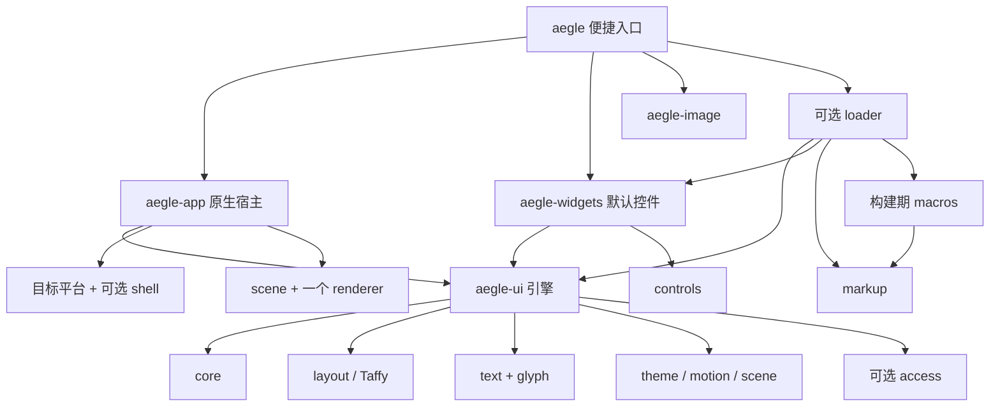

# 模块、依赖与构建组合

状态：v0.1 模块设计。types、core、layout、scene、text、glyph、controls、access、theme、motion、app、markup、macros、便捷入口、软件/Vulkan renderer 与 Wayland/Win32 平台已建立；实际覆盖范围见下文。其余模块及已建立模块的完整职责仍是设计目标，验证记录见[实现状态](implementation.md)。

## 拆分尺度

按可独立使用的能力和真实后端差异拆分。每个模块需有自己的 Interface：类型、所有权、调用顺序、错误和资源成本。模块不通过全局服务定位器寻找其他模块，由调用者显式传入能力。

| crate | 责任及独立用途 | Aegle 内部依赖 |
| --- | --- | --- |
| aegle-types | 几何、颜色、阴影值、光标形状及 `Preferences`、`TouchPhase` 等两个平台共用的小词汇；无平台依赖 | 无 |
| aegle-core | 槽位树、句柄、属性变更、事件路由、焦点 | types |
| aegle-layout | Taffy 低层树适配、Flex/Block 与可选 Grid；经过校验的布局值（`Length`、`Insets`、`Align`、`Justify`、`Direction`、`LayoutDirection`、`Wrap`，`Length::Calc` 为“百分比 + 像素”，grid 另有 `Track`、`Placement`、`Flow`、`TemplateItem`/`Repeat`/`template`、`areas`、`GridLine`/`GridLines`）；叶节点测量回调与可选的首基线回调（`compute_with_baselines`）；透明的 contents 节点；不依赖应用 | types、core |
| aegle-text | 字体、保留段落布局、纯文本编辑/组合状态与有界撤销 | types；scene 按 feature 接入 |
| aegle-glyph | Swash 字形光栅化、有界 CPU 缓存、共用字形身份/变换策略；字体内嵌位图的 PNG 解码来自 aegle-image | image、scene 按 feature 接入 |
| aegle-scene | 二维绘制命令、裁剪、共享图像/路径资源及可选字形记录 | types |
| aegle-gpu | GPU 后端共用、与图形 API 无关的部分：图元/裁剪记录、场景遍历、货架装箱、图像与路径 mask 放置、WGSL 着色器 | types、scene；vector feature 增加 zeno |
| aegle-render-vulkan | 几何、可选字形图集、裁剪、离屏读回与可选原生 swapchain | types、scene；glyph 按 text feature 接入 |
| aegle-render-software | 无 GPU 栅格绘制，与 GPU 共用 scene/文字资源 | types、scene；glyph 按 text feature 接入 |
| aegle-render-wgpu | 可选的最小跨平台 GPU 后端：几何、字形图集、裁剪、离屏读回与原生 surface 呈现 | types、scene；glyph 按 text feature 接入 |
| aegle-platform-wayland | Wayland 窗口、可选 layer-shell 表面、事件、IME、剪贴板、输出与平台偏好 | types |
| aegle-platform-win32 | Win32 窗口、IMM 兼容输入、DPI、GDI 软件与 GPU 句柄、外观偏好；TSF 待实现 | types |
| aegle-platform-appkit | 计划中，**尚未实现**：AppKit 窗口、NSTextInputClient 及平台偏好 | types |
| aegle-access | 原生回调排队/唤醒与可选 AccessKit adapter；宿主派生语义更新 | 无内部依赖；schema 为 AccessKit，unix/windows adapters 分别启用 |
| aegle-theme | 无分配的 Theme、控件类型 `ControlKind`（默认皮肤与可接受样式组）、视觉状态、Appearance/Style 和纯函数 Skin；局部主题继承、按字段的 `ThemeOverride`；类型化 `Token<T>` 与内置 token（注册表与绑定在 aegle-ui） | types |
| aegle-motion | 补间、过渡、关键帧动画与 Bézier/弹簧曲线；可无窗口独立推进 | types |
| aegle-controls | 可复用控件行为、语义动作与基础组合；无默认皮肤 | types；text feature 接 text，树与路由由宿主提供 |
| aegle-widgets | 默认控件库，包含全部默认控件：Label、Button、TextField（单/多行）、CheckBox、Switch、Radio、Slider、Progress、ImageView、Canvas、ScrollView、ListView、Table、Popup、Dropdown、Menu、MenuBar，以及它们的类型与中性皮肤（`kinds`）和纯函数绘制（`paint`）；通过 `Control` trait 与 `Hooks` 接入 aegle-ui，创建入口是 `Widgets` trait | ui、controls、text、scene、theme、core、layout、types；access 按 feature |
| aegle-image | 有界图像解码：PNG（始终可用，字体位图用 `decode_into`）与可选 JPEG、WebP、GIF 首帧、静态 SVG 栅格化，以及可选的渐变/阴影图像（`effects`）；不依赖任何 UI | scene；解码器按 feature |
| aegle-markup | 有界解析、跨度、内建控件 schema、多文件导入与 state/表达式/事件/块/组件的类型检查 | 无 |
| aegle-macros | ui! 文件编译与有类型 View 生成，仅编译期运行；动态文档生成已检查程序的构造代码 | markup |
| aegle-loader | 动态标记执行引擎：绑定、事件、if/for、组件实例、运行时加载与显式重载 | ui、widgets、markup；app 按 feature |
| aegle-ui | 无窗口保留式 UI 引擎：节点树、布局、输入路由与焦点、滚动与滚动条、光标、触摸/惯性、主题、过渡、IME 与语义导出；控件通过开放的 `Control` trait（经 `InputCx`/`MeasureCx`/`PaintCx`/`SemanticsCx` 上下文）和 `Hooks` 接入，引擎不含任何具体控件 | types、core、layout、scene、text、controls、theme、motion；access 按 feature |
| aegle-app | 原生应用宿主：App/Window、事件循环、平台与 renderer 选择、系统偏好、后台代理（UiProxy）；每窗口一个 `Ui` | ui、types、scene、text；平台、renderer、access 按 feature；widgets 仅用于测试 |
| aegle | 应用便捷入口与重导出（app、ui、widgets、image），不提供另一套实现 | app、ui、widgets、image；其他按 feature 重导出 |

层次：`aegle-ui` 是引擎，`aegle-widgets` 是默认控件库，`aegle-app` 是原生宿主；三者单向依赖（widgets→ui，app→ui），ui 不依赖 widgets 或任何平台/renderer。自带控件的库可只依赖 `aegle-ui` 实现 `Control`；自带窗口/绘制宿主的程序可只依赖 `aegle-ui` 与 `aegle-widgets`。`Hooks` 让虚拟列表、弹出层、单选组等需要跨节点协作的行为留在控件库内，引擎只提供调用点；各库的节点外数据存于 `State::ext`。

表中的简称指同名前缀 crate。文字无障碍为 `aegle-text/text-a11y`，映射 Parley 的可选 AccessKit 支持；基础文字模块不强制启用它。平台 adapters 按 target 编译，不能把三平台实现都塞进一个程序。

当前 `aegle-scene` 使用 no_std + alloc，默认只依赖 types；`text` 仅增加轻量的 `linebender_resource_handle`，通过共享 `FontData` 及独立 run 旁表保存字形记录，不引入 Parley 或 Swash。纯几何命令不携带完整字体/run 数据。图像与路径以 `Arc` 共享句柄保存在 scene 旁表，路径光栅化留在各 renderer 内部，不另设路径 crate。

`aegle-render-software` 借用调用方像素缓冲，不依赖 core、Taffy 或窗口；默认是纯几何构建，没有字体栈和 PNG 运行依赖。tiny-skia 0.12（仅 std/simd）完成覆盖率栅格化，小型自有实现完成线性光 SourceOver。`text` 显式增加 aegle-glyph，其 PNG 解码器用于字体内嵌位图。软件后端不依赖 aegle-text，其他 shaping 宿主也可提供 scene 字形记录。

`aegle-render-vulkan` 通过 ash 0.38 和 bytemuck 1.25 消费相同 Scene，支持几何、最多八层裁剪及显式 RGBA8 读回。默认纯几何不带字体；可选 `text` 用 glyph、scene/text 和 hashbrown 管理按需 R8/RGBA8_SRGB 图集，复用下述字形身份与光栅策略，不依赖 Parley。没有 core、平台窗口库或软件 renderer 的正常依赖；可选 window 仅增加 raw-window-handle；Naga 30 仅在构建期生成 SPIR-V。swapchain 与 App 显式后端选择已接入，详见 [Vulkan 契约](vulkan.md)。

`aegle-gpu` 不接触任何图形 API：`Walker` 把 Scene 逐命令转成 112 B 图元行与 64 B 裁剪行（`Recording`，带字节上限），几何、渐变与阴影命令就地记录（渐变色标两个一行附在裁剪行中），字形、图像、路径交回后端处理；`aegle-gpu` 因此是两个 GPU 后端行为一致的单一来源，也是它们的 WGSL 的来源（Vulkan 的 build.rs 以它为构建依赖）。

`aegle-render-wgpu` 消费相同 Scene，经 wgpu 30 在 Vulkan、Metal、Direct3D 12 上绘制几何、最多八层裁剪与 mask/color 字形，不依赖 Parley、Vulkan 后端或 ash；可选 `window` 只增加 raw-window-handle。图像与 CPU 光栅的路径 mask 共用同一图集，放不下的得到专用纹理。与 Vulkan 后端共用的部分见 [wgpu 契约](wgpu.md)。

`aegle-text` 默认启用 Parley std，并复用其已有的 ICU 分段包处理 grapheme 删除；系统字体、词典、文字无障碍和 scene 桥接分别可选。段落与 Editor 共用 TextSystem 字体/shaping 上下文，Editor 包装 PlainEditor 并补充稳定提交值、可取消组合和有界 delta 历史；不另建编辑引擎或转发 crate。scene 桥接共用字形绘制，额外记录选择、预编辑和光标；平台 IME、剪贴板及系统语义由平台/应用层连接。

`aegle-glyph` 独立接受共享字体句柄，复用 Swash、Skrifa、hashbrown 与 lru-slab，不自建字体解析器或通用缓存框架。缓存不保留字体字节；段落、编辑器及 scene 的字体句柄维持各自资源寿命。

该模块公开共用的借用/拥有字形缓存身份；可选 `scene` feature 依赖 `aegle-scene/text`，提供 renderer 共用的字体缩放、整像素基线与水平四相位、灰度对比曲线和 bitmap 仿射策略。默认字形缓存仍不依赖 scene。

`aegle-platform-wayland` 复用 SCTK、wayland-client 与 calloop 管理同一连接、多个普通窗口和原生输入。平台只依赖 types；TextSystem、Editor、Scene 和 renderer 在可执行示例中组合，不成为平台的发布依赖。软件呈现直接借出有界 SHM 像素；text-input-v3 以带 seat 身份的事务传递给宿主。gpu feature 提供带生命周期的原生 surface 租约，启用 libwayland system backend。layer-shell 表面与 xdg 窗口共用窗口表、输入、IME 和呈现路径，由 `WindowOptions::layer` 选择，不另设 crate 或 feature；剪贴板按 seat 使用 data device 与非阻塞管道。托盘、通知和全局快捷键不在该模块内。

`aegle-controls` 默认提供无分配的 Button/Toggle/Slider、共享 Range 状态及借用 Input/Outcome；`text` 增加复用 Editor 的 TextField。它不依赖 core、布局、主题、renderer 或窗口。宿主在自己的树中保存行为状态，负责命中、焦点和 capture；键盘、指针及语义激活经过同一默认行为。Wayland editor 示例使用 core 的 Route/Focus 连接这套行为，不再另写编辑快捷键与 IME 文本替换。可选 aegle-access/unix 已在示例接通 AT-SPI 的查询、焦点、按钮及文字选择，完整系统无障碍仍未完成。

`aegle-access` 的 Mailbox/Handlers 将原生线程上的请求交给宿主自己的 UI 线程，不引入另一棵应用树。UnixAdapter 复用 AccessKit 的系统协议与语义缓存，收到初次请求时完整导出，其后按脏标记更新。text-a11y 文本桥补充 run 身份/范围校验；平台、控件和文字依赖仍可分开选择。

`aegle-theme` 是 no_std、无分配的小型值类型，只依赖 types。`Theme` 提供浅色、深色和高对比配色以及正文、间距、圆角和控件高度；Appearance/Style 按控件状态解析独立于行为的外观，Skin 是纯函数指针；自定义值在宿主接受时验证。app 用稀疏表保存本地外观和字号，不把完整 Style 放进每个节点；局部主题由子树节点共享一份 `Rc<Theme>`。token 注册表、全局/子树 token 覆盖与属性绑定（Style、字号、字体、padding/gap、过渡时长）由 aegle-ui 保存（稀疏表，按索引）；系统偏好由平台 crate 报告，原生 App 据此选择主题；可选外观/位移过渡由 app 连接独立 motion 模块。

`aegle-ui` 不创建平台依赖。`Ui::with_fonts` 接受可共享的 TextSystem，拥有一棵控件树，提供容器（row/column、透明的 contents 分组，`grid` feature 下另有 grid/stack）与完整的 flex/grid 布局 setter、滚动、主题、过渡、输入、IME 与语义接口，具体控件由 `aegle-widgets` 通过 `Widgets` trait 创建。平台宿主可分别调用输入、刷新、scene 遍历、IME 和可选语义接口。`aegle-app` 的 `wayland` / `windows` 按目标增加原生 App，`software` / `vulkan` / `wgpu` 分别增加 renderer；各窗口独立拥有 Ui，共享平台和字体；软件 renderer 共用，GPU 窗口共享第一个窗口创建的设备，图集按窗口独立。

ScrollView 的偏移、嵌套滚轮传递和焦点显露由 ui 协调现有树与布局，不新增滚动 crate。renderer 仍不依赖控件树：scene 遍历给宿主传递平移和外部矩形裁剪，由宿主应用；绘制、输入、IME 和可选语义共享 ui 派生的滚动几何。

`aegle` 重导出 app、ui、widgets 与 image，不复制实现。当前默认 `desktop` 组合是 **目标平台原生窗口（Linux Wayland / Windows Win32）+ 软件绘制 + 系统字体 + 词典分词 + 编译型标记（含动态标记引擎） + 外观过渡**，不是下表的目标 GPU 组合。系统无障碍适配默认不启用：Linux AT-SPI 引入 zbus 与异步运行时，由 `unix-accessibility` 选择；Windows UIA 由 `windows-accessibility` 选择。`aegle-ui` / `aegle-widgets` 的 `accessibility` 仅启用语义树导出，`aegle-app` 转发它，`unix-accessibility` 另接系统 adapter；`system-fonts` 可关闭并改用显式字体。当前 facade 的 `default-features = false` 仍保留 Ui 的文字等基本依赖；需要更小的单一能力时直接选择底层 crate。Vulkan 可选且无需编译软件 renderer；macOS 原生宿主与缩放/旋转动画仍待实现；动态标记由 `markup` 中的 loader 执行。

`aegle-markup` 是无第三方依赖的有界解析器、schema 与类型检查器；不依赖 app 或任何平台，可供外部工具独立检查，I/O 由调用方的读取函数提供。`aegle-macros` 复用它，并用 syn/quote/proc-macro-crate 处理 Rust 宏参数、代码生成与依赖别名，避免自建 Rust 语法处理。facade 的可选 `markup` 增加编译期宏与 `aegle-loader`：静态文档生成直接创建控件的代码，不链接引擎；动态文档生成构造已检查程序的代码并由引擎执行，发布程序不带解析器。引擎以 state 单元和效果（effect）记录绑定依赖，绑定与块随控件通过 `Node::keep_alive` 释放；运行时加载额外链接解析器。

`aegle-motion` 提供无时钟所有权的 Tween/Transition 与关键帧 Animation（延迟、循环、往返），支持 f32、Point、Color 与二次、Bézier、弹簧曲线；只有多关键帧动画分配一次共享帧数组；仅依赖 types 的可选 `color-math`。该 feature 需要 std，将软件合成与动画共用的 sRGB 转换表放在一个 OnceLock 中，types 默认仍为 no_std。app 的可选 `motion` 维护节点外观目标/呈现值并驱动失效；无需 motion 时不会编译其映射表或调度代码。

`aegle-theme` 与 `aegle-motion` 公开函数不多，仍各自成 crate：两者是只依赖 types、不接触控件树的值库。theme 为 no_std 且不分配，widgets 的纯函数皮肤、第三方控件库或 renderer 可只依赖它取得同一套配色、`Style` 与 `Appearance`，不必编译需要 std、Taffy 与 Parley 的引擎；motion 的 Tween/Animation 由调用者给时间，可在不用引擎的宿主中单独采样，引擎也只在 `motion` feature 下链接它。并入 aegle-ui 会让只要这些值的使用者编译整个引擎；再细分则没有对应的消费者。aegle-ui 重导出两者的类型，经引擎使用时无需另加依赖；独立使用的方式见[不经 facade 使用控件库](developer/standalone.md)。

没有独立的“每个控件 crate”或“每个颜色类型 crate”。当一个模块的多种选择只影响内部小函数时使用 feature，不为包装一个转发函数增加新的包。

## 依赖方向

这是一张依赖图，不是每次更新必须经过的多层调用链。markup 只定义语言、节点属性和元素规格 `ElementSpec`，不认识任何具体元素；loader 定义元素契约 `Element` 并用 macros 的 `element!` 声明内置元素，第三方控件库以同样方式声明自己的元素。core 不依赖 ui、app、widgets、loader、GPU 或操作系统库；renderer 不依赖控件或标记语言。

## 目标默认组合与可裁剪组合

本表为完整版本的设计目标；当前可编译 feature 以各 crate 清单及上面的实现说明为准。

| 组合 | 包含 | 不自动包含 |
| --- | --- | --- |
| `aegle` 默认 desktop | 目标平台、目标 GPU、Taffy Flex/Block、CJK 文本/编辑与词典分词、默认组件、主题、基本补间、编译宏 | 系统无障碍适配、运行时加载、SVG 与 JPEG/WebP/GIF、SVG 字形、Grid、弹簧 |
| `default-features = false` | 不自动选择窗口/renderer；使用者显式加所需功能或直接用独立模块 | 便捷默认组合 |
| `runtime-ui` | loader、所注册组件的类型描述与宿主动作 | 通用脚本 VM、文件监视器 |
| `text-dictionary` | 中日词典分词及相关复杂文字分段数据 | 网络字体 |
| `effects`（桌面默认）/ `colrv1`（桌面默认）/ `jpeg` / `webp` / `gif` / `svg` | 渐变与阴影图像、COLRv1 字形、各图像格式、静态 SVG（图像与 OpenType-SVG 字形） | 彼此不暗中全部开启 |
| `grid` | Taffy Grid 算法、`grid`/`stack` 容器与标记 `Grid`/`Stack`（release 约 244 KiB） | 默认 desktop 不包含 |

默认桌面组合启用无障碍与减少动态效果支持。嵌入式应用可以显式不编译 OS 无障碍 adapter；不能将这种构建宣传为完整无障碍构建。省掉平台 adapter 不要求删除控件的基本语义定义。

Cargo feature 在依赖图中会统一：不能承诺同一程序里的某个控件使用有字典的 Parley，另一个控件因此完全不承担其静态数据成本。发布检查必须查看实际闭包和最终文件，而不是只查看 facade 清单。

## 扩展契约

第三方可以注册控件、主题 token、动作和新的 renderer/platform adapter，使用稳定 Rust 接口；不提供动态二进制插件 ABI。组件库依赖 core/controls/theme/scene 等实际需要的模块，不必依赖整个 aegle。只改外观的组件复用行为，只有新增交互时才实现新的行为。

首版只承诺文档所列 capability。扩展能力不存在时返回结构化错误或使用明确的组件降级方案，不依赖反射查找“可能存在”的隐藏服务。

`aegle/native` 是 wayland/windows 的目标平台便捷组合，不编译另一个 OS 的平台依赖。最小命令式软件 hello 选择 native,software,system-fonts；仅 Vulkan 则选择 native,vulkan,system-fonts。两个 renderer 同时编译时默认软件，显式 AppOptions.renderer 切换；没有 renderer feature 时构造返回错误。标记与 motion 继续单独选择。Windows adapter 同样可由 windows-accessibility 独立关闭。
