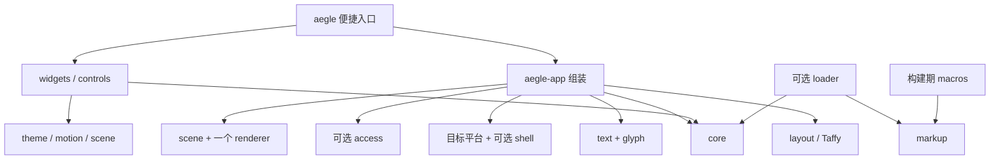

# 模块、依赖与构建组合

状态：v0.1 设计决定。下面是实现时建立的 workspace crate 职责，不表示当前已创建这些 crate。

## 拆分尺度

按可独立使用的能力和真实后端差异拆分。每个模块需有自己的 Interface：类型、所有权、调用顺序、错误和资源成本。模块不通过全局服务定位器寻找其他模块，由调用者显式传入能力。

| crate | 责任及独立用途 | Aegle 内部依赖 |
| --- | --- | --- |
| aegle-types | 几何、颜色、资源 ID、通用错误与能力描述；无平台依赖 | 无 |
| aegle-core | 槽位树、句柄、属性变更、事件路由、焦点 | types |
| aegle-layout | Taffy 低层树适配、Flex/Block 与可选 Grid | types |
| aegle-text | 字体、段落测量、文字布局和编辑模型 | types |
| aegle-glyph | Swash 字形光栅化与有界 CPU 字形缓存 | types |
| aegle-scene | 二维绘制命令、裁剪、资源请求及 renderer 契约 | types |
| aegle-render-vulkan | Vulkan 实现、上传、图集与呈现 | types、scene |
| aegle-render-metal | Metal 实现、上传、图集与呈现 | types、scene |
| aegle-platform-wayland | Wayland 窗口、事件、IME、输出与平台偏好 | types |
| aegle-platform-win32 | Win32 窗口、TSF/必要兼容路径及平台偏好 | types |
| aegle-platform-appkit | AppKit 窗口、NSTextInputClient 及平台偏好 | types |
| aegle-shell-wayland | layer-shell 表面策略，共享 Wayland 连接和事件队列 | types、platform-wayland |
| aegle-access | 语义快照/差量和目标平台 AccessKit adapter | types |
| aegle-theme | 有类型的主题 token、局部覆盖与状态取值 | types |
| aegle-motion | 时间、补间、过渡及可选弹簧；可无窗口独立推进 | types |
| aegle-controls | 可复用控件行为、语义与基础组合；无默认皮肤 | types、core；文本编辑按需接 text |
| aegle-widgets | 默认中性极简皮肤和常用组件 | controls、theme、scene；motion 按 feature 接入 |
| aegle-path | Lyon 路径细分，可交给其他绘制宿主 | types、scene |
| aegle-assets | 有界 PNG 解码与可选运行时 SVG 光栅化 | types |
| aegle-markup | 解析、跨度、类型化中间表示与语言校验 | types |
| aegle-macros | ui! 编译与组件元数据生成，仅编译期运行 | markup |
| aegle-loader | 可选运行时加载、表达式执行与显式重载 | types、markup、core |
| aegle-app | 将窗口、UI、布局、绘制、文本与可选能力连接起来 | core、layout、scene；其余按构建组合启用 |
| aegle | 应用便捷入口与重导出，不提供另一套实现 | app；其他按 feature 重导出 |

表中的简称指同名前缀 crate。文字无障碍为 `aegle-text/text-a11y`，映射 Parley 的可选 AccessKit 支持；基础文字模块不强制启用它。平台 adapters 按 target 编译，不能把三平台实现都塞进一个程序。

没有独立的“每个控件 crate”或“每个颜色类型 crate”。当一个模块的多种选择只影响内部小函数时使用 feature，不为包装一个转发函数增加新的包。

## 依赖方向

这是一张依赖图，不是每次更新必须经过的多层调用链。core 不依赖 app、widgets、loader、GPU 或操作系统库；renderer 不依赖控件或标记语言。

## 默认组合与可裁剪组合

| 组合 | 包含 | 不自动包含 |
| --- | --- | --- |
| `aegle` 默认 desktop | 目标平台、目标 GPU、Taffy Flex/Block、CJK 文本/编辑、无障碍、默认组件、主题、基本补间、编译宏 | 运行时加载、shell、SVG、路径特效、Grid、词典分词、弹簧 |
| `default-features = false` | 不自动选择窗口/renderer；使用者显式加所需功能或直接用独立模块 | 便捷默认组合 |
| `runtime-ui` | loader、所注册组件的类型描述与宿主动作 | 通用脚本 VM、文件监视器 |
| `shell` | Linux layer-shell；共享既有 Wayland backend | 托盘、通知、D-Bus 业务服务、全局快捷键 |
| `text-dictionary` | 中日词典分词及相关复杂文字分段数据 | 网络字体 |
| `vector` / `svg` / `effects` | 分别增加路径、SVG 和阴影/模糊能力 | 三者不互相暗中全部开启 |

默认桌面组合启用无障碍与减少动态效果支持。嵌入式应用可以显式不编译 OS 无障碍 adapter；不能将这种构建宣传为完整无障碍构建。省掉平台 adapter 不要求删除控件的基本语义定义。

Cargo feature 在依赖图中会统一：不能承诺同一程序里的某个控件使用有字典的 Parley，另一个控件因此完全不承担其静态数据成本。发布检查必须查看实际闭包和最终文件，而不是只查看 facade 清单。

## 扩展契约

第三方可以注册控件、主题 token、动作和新的 renderer/platform adapter，使用稳定 Rust 接口；不提供动态二进制插件 ABI。组件库依赖 core/controls/theme/scene 等实际需要的模块，不必依赖整个 aegle。只改外观的组件复用行为，只有新增交互时才实现新的行为。

首版只承诺文档所列 capability。扩展能力不存在时返回结构化错误或使用明确的组件降级方案，不依赖反射查找“可能存在”的隐藏服务。
